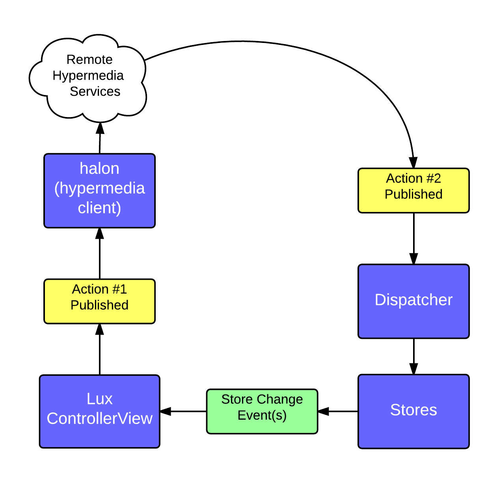
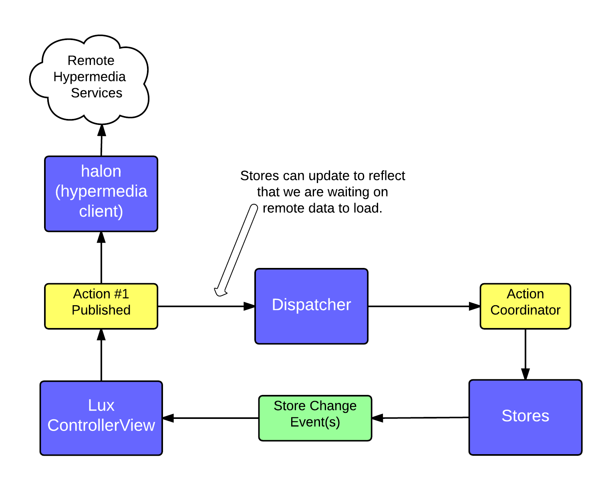
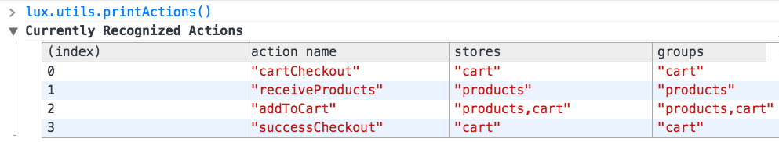
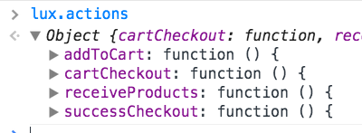
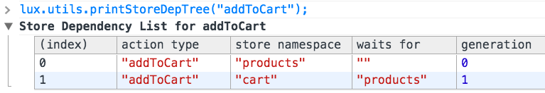

# lux.js - How React & Flux Are Impacting LeanKit
It's been an exciting year for my team at LeanKit. Last May we kicked off a project using ReactJS - an open source project from Facebook described as "A JavaScript Library for Building User Interfaces". Over the course of the project, we've learned a lot about React and Flux - Facebook's recommended architectural principles for React apps. Today we'll take a look at some of the key lessons we've learned. Whether you're new to React & Flux, or going as far as building your own Flux implementation, I think you'll not only enjoy this journey with us, but find some thought-provoking questions and wisdom you can apply in your own React endeavors.

## Helpful Background
Already familiar with React and Flux? Feel free to skip to "What is Lux?".

### React
[Telerik](http://developer.telerik.com/featured/introduction-to-the-react-javascript-framework/) recently called 2015 "the year of React". Odds are you've heard of it. I've included a list of recommended reading at the end of this post so you can explore more on your own. However, let's lay out a high level summary of React:

* React focuses on view concerns, and does not attempt to be an "everything framework"
* React UIs are built out of components - which can have their own private state (if applicable) as well as props (which are typically passed in from a parent, and are considered immutable).
* React components can be written using JSX - an XML-based extension to JavaScript, or with plain JavaScript.
* React components render to a "virtual DOM". Subsequent renders are diffed with the previous render, and the minimum number of DOM mutations are calculated and batch-executed to effectively "patch" the DOM to bring it up to date.
* React encourages one-way data binding - definitely a contrast compared to trends over the last few years. Data flows down, from parent to child via props.

### Flux

Flux is an architectural pattern Facebook recommends for building apps with React. Where React's opinions *nudge* you towards uni-directional data flow, Flux provides a fuller picture as to what that *actually* looks like. Several Flux implementations have arisen (LeanKit's lux.js, included), providing a fascinating view into how different teams are tackling the challenges they face. You can explore more about Flux in the recommended reading links. A good summary, for now:

* Flux apps have three main abstractions: views (React components), stores and the dispatcher.
* Views "propagate" actions (e.g. - user interaction) through the dispatcher.
* The dispatcher handles notifying the various stores of the action.
* If a store's state changes, it emits a change event, and views depending on that store for state will re-render

## What is Lux?

The rate at which JavaScript developers crank out new frameworks sometimes approaches the rate at which certain countries borrow against future generations. Why, then, write another framework? I love this subject, though it falls outside the scope of this article. It's sufficient to say it comes down to *need*. Our team has a specific set of needs, skills and goals that we've tailored lux to fit. We firmly believe that a "stack" is superior to a "framework". Our work with lux attempts to strike a delicate balance between consistent opinions and flexibility to include other libraries that best solve for the concern at hand.

When I first began writing lux, I had these goals in mind:

* Enhance & extend, *not hide*, React.
* The use of convention should eliminate boilerplate as much as possible (how views listen to stores, how stores declare dependencies on other stores, how action creator APIs are used, etc.)
* Actions should be capable of crossing window/worker boundaries (i.e. - serializable). QUESTIONABLE
* Non-lux/non-react instances should be able to easily participate in the app alongside lux abstractions.
* I wanted to avoid long case/branching logic in the dispatcher.

Dmitri Voronianski has a wonderful GitHub repo called [flux-comparison](https://github.com/voronianski/flux-comparison), which lets you see a side-by-side comparison of several flux variants (using a basic shopping cart example). I've implemented the same example using lux to help illustrate the direction we've taken.

### Components
You will often hear React developers refer to "controller views". A controller view is a React component that typically sits at or near the top of a particular section of the page, which listens to one or more stores for changes in their state. As stores emit change events, the controller view updates with the new state and passes changes down to its children via props. Lux provides a convenient way to create a controller view:

```
var CartContainer = lux.controllerView({

    getActions: [ "cartCheckout" ],

    stores: {
        listenTo: [ "cart" ],
        onChange: function() {
            this.setState(getStateFromStores());
        }
    },

    getInitialState: function () {
        return getStateFromStores();
    },

    onCheckoutClicked: function () {
        var products = this.state.products;
        if (!products.length) {
            return;
        }
        this.cartCheckout(products);
    },

    render: function () {
        return (
            <Cart products={this.state.products} total={this.state.total} onCheckoutClicked={this.onCheckoutClicked} />
        );
    }
});
```

Calling `lux.controllerView` to create our CartContainer gives us a React component with two mixins included: lux's store mixin and actionCreator mixin. The store mixin makes use of the `stores` property. The `listenTo` array contains the namespace for any store this controller view needs to listen to. The `onChange` handler is invoked when any of the stores emit a change event. (Note that if more than one store is being listened to, and all emit a change event, this handler is invoked after all the events have been emitted.) There's no other event wire-up involved.

In a Flux app, it's common for your components to use action creator APIs, but not need to listen to any stores. So while components created using `lux.controllerView` can do both of those things, you can call `lux.component` if you need a React component with just the actionCreator mixin:

```
var ProductItemContainer = lux.component({

    getActions: [ "addToCart" ],

    onAddToCartClicked: function () {
        this.addToCart(this.props.product);
    },

    render: function () {
        return (
            <ProductItem product={this.props.product} onAddToCartClicked={this.onAddToCartClicked} />
        );
    }
});
```

Our ProductItemContainer provides a `getActions` array, which lux uses to provide the requested action creator API(s) to the component itself. This is one area where lux diverges a bit from other Flux implementations - let's explore why.

### Action Creator APIs
In several of the examples in the flux-comparison project, you'll see some sort of action creators implementation. For example, this is the `cartActionCreators.js` file in the [Marty]() example folder:

```
'use strict';

var Marty = require('marty');
var ShopAPI = require('../sources/shopAPI');
var CartConstants = require('../constants/cartConstants');

var CartActionCreators = Marty.createActionCreators({
    types: {
        addToCart: CartConstants.ADD_TO_CART,
        cartCheckout: CartConstants.CART_CHECKOUT
    },

    addToCart: function (product) {
        this.dispatch(product);
    },

    cartCheckout: function (products) {
        this.dispatch(products);
        ShopAPI.checkoutProducts(products);
    }
});

module.exports = CartActionCreators;
```

Action creators in lux started in a fairly similar way. We opted to use [postal.js]() for communication & subscriptions, so our action creator methods often did little more than publish the structured "action" payload:

```
addToCart: function( product ) {
	actionChannel.publish( {
		topic: "execute.addToCart",
		data: {
			actionType: "addToCart",
			actionArgs: [ product ]
		}
	} );
}
```

Obviously, this was a very easy thing to generalize, so we created the actionCreator mixin that provides a generic `publishAction` method:

```
addToCart: function( product ) {
	this.publishAction( "addToCart", product );
}
```

Meanwhile, we'd fallen into the practice of having matching handler names (i.e. - matching the name of the action being handled) in our stores, which made a conventional wire-up very simple. With stores and actions getting matched by convention, and with 98% of our action creator methods making the `publishAction` call, it was a small step to go all the way and infer the creation of action creator methods based on the handler names in our stores. The actual action creator methods were being stored under lux.actions at this point, so it seemed a natural conclusion to have any component specify the action names it wanted and lux would provide them on the instance via mixing-in, rather than require the component to pull in an additional dependency. 

#### Every Input is an Action
Since this behavior of "providing action creator APIs" was abstracted into a mixin, it made it possible for both React components as well as "non-lux/react" instances to use the mixin. My team has been taking advantage of this when it comes to things like remote data APIs (we're using a hypermedia client called [halon]()). Our client-side wrapper for halon uses this mixin so that it can not only publish actions, but also handle them. 

We approach it this way because we believe every input - whether it be user input or queued async execution (via AJAX, postMessage, WebSockets, etc.) - should be fed into the client as an Action. If you've kept up with any of the React discussions over time, you might be thinking "Jim, Facebook is OK with calling dispatch directly on an XHR response, rather than use another Action Creator". Absolutely - and that makes perfect sense when your implementation gives your "util" modules (like remote data APIs) a handle to the Dispatcher. With lux, we opted for the gateway to the Dispatcher to be via message contract (more on that in a bit), and removed the need for the Dispatcher to be a dependency of any module.

So if every "input" is an Action, then this means we have Actions in our system that none of our stores care about. Other Actions might be of interest to both a store as well as our remote data API. The value of how this complements and forces you into the "pit of uni-directional data flow success" can be illustrated in this image:



In the above scenario, our user might have clicked a button on the page that resulted in the need to load data from the server. When that data returns, it's published as a new Action. While we *know* that the two actions are related, modeling things this way reinforces the avoidance of cascading updates, *and* it means your app's behavior will be capable of handling data being *pushed* to it, not just *pulled* through http requests.

What if we wanted to update the UI to reflect that data is loading? It's as easy as having the appropriate store handle the same action:



One benefit about treating every input as an Action: It makes it easy to grasp behaviors are possible your app. For example, here's the output of calling `lux.utils.printActions()`:



#### Actions, Stores & Remote Data I/O
This is a good time to mention what I believe is a classic pitfall to those rolling their own Flux implementations: putting remote data i/o in stores. In the first version of lux, I not only fell into this pit, I pulled out a golden shovel and dug it even deeper. Our stores had the ability to make http calls - and as a result, the need for Action dispatch cycles to be asynchronous was unavoidable. This introduced a ripple effect of bad side effects:

* Retrieving data from a store was an asynchronous operation, so it wasn't possible to use a store's state in a controller view's `getInitialState` method.
* We found that requiring asynchronous reads of store state discouraged the use of "read only" helper methods on Stores.
* Putting i/o in stores led to actions being intiated by stores (e.g. - on XHR responses or WebSocket events). This was quickly undermining the gains from uni-directional data flow. Flux Stores publishing their own actions could lead to cascading updates - the very thing we wanted to avoid!

I think the temptation to fall into this pit has to do with the trend of client-side frameworks to-date. Client-side models are often treated as write-through-caches for server-side data. Complex server/client synchronization tools have sprung up, effectively encouraging a sort of two-way binding across the server/client divide. Yoda said it best: You must unlearn what you have learned.

About the time I was realizing I'd be better off making lux Stores synchronous, I read Reto Schläpfer's post ["Async requests with React.js and Flux, revisited."](http://www.code-experience.com/async-requests-with-react-js-and-flux-revisited/). He had experienced the same pain, and the same realization. Making lux Stores synchronous from the moment the Dispatcher begins handling an Action to the moment Stores emit change events made our app more deterministic and enabled our controller views to synchronously read Store state as they intialized. We finally felt like we'd found the droids we were looking for.


### Stores
Let's take a look at one of the lux Stores in the flux-comparison example:

```
var ProductStore = new lux.Store( {

    state: { products: [] },

    namespace: "products",

    handlers: {
        receiveProducts: function( products ) {
            this.setState( { products: products } );
        },
        addToCart: function( product ) {
            var prod = this.getState().products.find( function( p ) {
                return p.id === product.id;
            } );
            prod.inventory = prod.inventory > 0 ? prod.inventory - 1 : 0;
        }
    },

    getAllProducts: function() {
        return this.getState().products;
    },

    getProduct: function( id ) {
        return this.getState().products.find( function( p ) {
            return p.id === id;
        } );
    }
} );

```

A lux Store, at the very least, has to provide a `handlers` property and a `namespace`. The names of the methods on the `handlers` property match the Action name that they handle. You can also set initial state on the store, as we're doing above, and provide top-level methods that are used for reading data (the lux Store prototype also provides a generic `getState()` method). lux Stores also provide `setState` and `replaceState` methods - but if you attempt to invoke them directly, an exception will be thrown. Those methods can only be invoked during a dispatch cycle - we put this rather heavy-handed opinion in place to reinforce the guideline that only stores mutate their own state, and that's done in a handler.

In keeping with Flux principles, it's possible for lux Stores to wait on other stores before executing their handler. You can specify the stores you need to wait on per-action. Here's an example of how the CartStore waits on the ProductStore for its addToCart Action handler:

```
handlers: {
    addToCart: {
        waitFor: [ 'products' ],
        handler: function( product ) {
            var newState = this.getState();
            newState.products[ product.id ] = (
                newState.products[ product.id ] ||
                assign( products.getProduct( product.id ), { quantity: 0 } )
            );
            newState.products[ product.id ].quantity += 1;
            this.setState( newState );
        }
    }
}
```

In the `waitFor` array, you specify the namespaces of any other store you need to wait on. The Dispatcher determines the order in which stores need to execute their handlers at runtime, so there's no need to worry about managing the order yourself in your Store logic. (Note that if you don't need to wait on any other stores, the handler value can be just the handler function itself rather than the object literal representation above.)

Over time we found that several of our stores shared some common elements. Doug Neiner and Ryan Niemeyer came up with an idea for lux Stores to support mixins in the store constructor, so that the common behavior could be abstracted out. The Store constructor allows you to pass in any number of mixins. They will be deep-merged, and the `handlers` will not only be deep-merged, but same-name-handlers will be queued to execute in the order in which they are mixed in. For example:

```
var kanbanBoardStore = new lux.Store(
	{ namespace: "board" },
	boardLoadedMixin,
	laneSelectionMixin,
	cardSelectionMixin
);
```
The above snippet shows how 3 mixins are being applied to the `kanbanBoardStore`. If all of the mixins happen to have a `handlers.boardLoaded` handler, then they will be queued to run in the order listed above. To be fair, this is a rare use-case we haven't used a lot - but when it does arise, this works nicely.

#### Store Handlers & Actions
Any store, as well as any other instance making use of the ActionListener mixin, will be scanned, and the handler names listed will be used to create Action Creator APIs. We can still create our own Action Creator APIs manually if necessary, but elminating the boilerplate behind creating an Action Creator API has worked out very well for us so far. For example, once lux has scanned the ProductStore and CartStore instances, matching Action Creator methods will appear under `lux.actions`:



### Dispatcher
You will likely never have to interact with the lux Dispatcher. First, you don't have to create an instance of it (it's available as soon as lux has loaded) and second, since we use postal for communication, the Dispatcher automatically wires up to listen for relevant messages. Internally, the Dispatcher is a finite state machine (we used machina's `BehavioralFsm` constructor for this). Since everything is synchronous from the moment the Dispatcher receives a message to the moment components are notified of store updates, only one Action can be processed at a time (reinforcing the deterministic nature Flux brings to your app).

### Interacting w/ non-lux instances
Another key lesson for our team - lux needs to make it easy for non-React/lux instances to play well with together. To that end, lux provides mixins that can be used by something other than React components and Stores.

#### Store Mixin
The `store` mixin enables you to listen for store change events. For example, this constructor function returns an instance that's wired to listen to our ProductStore and CartStore:

```
var StoreLogger = function() {
    this.initialize.apply( this, arguments );
};

StoreLogger.prototype = {
    constructor: StoreLogger,
    stores: {
        listenTo: [ "products", "cart" ],
        onChange: function() {
            console.log( "STORE LOGGER", "Received new state" );
        },
    },
    initialize: function () {
        lux.mixin( this );
    },
    teardown: function () {
        this.luxCleanup();
    }
};
```
lux controller views use the same mixin, effectively, it just wires the setup into the appropriate component lifecycle methods.

#### Action Creator Mixin
The actionCreator mixin gives the instance a `publishAction( actionName, arg1, arg2...)` method. This method handles packaging the metadata about the Action into a message payload and then publishes it (if you've created a custom action creator that does more than just publish the action message, it will invoke that behavior):

```
// calling lux.actionCreator is a convenience wrapper around
// lux.mixin( target, lux.mixin.actionCreator );
var creator = lux.actionCreator( {
	doAThing: function() {
		this.publishAction( "doJazzHands", "hey, I can lux, too!", true, "story" );
	}
} );
```

#### Action Listener Mixin
The actionListener mixin wires the instance into postal, so that it listens for any lux action messages. When a message arrives, it checks the `handlers` property for a matching handler and invokes it:

```
var listener = lux.actionListener({
	handlers: {
		doJazzHands: function(msg, someBool, lastArg) {
			console.log(msg, someBool, lastArg); // -> hey, I can lux, too! true story 
		}
	}
});
```

#### Why Not Both?
It's not uncommon – especially if remote data API wrappers are involved – to need both the actionCreator and actionListener mixins. lux provides a convenience method for this, unsurprisingly named `actionCreatorListener`. In the flux-comparison example, the wrapper around the mock remote data API uses this:

```
// WebAPIUtils.js
var shop = require( '../../../common/api/shop' );
var lux = require( 'lux.js' );

module.exports = lux.actionCreatorListener( {
    handlers: {
        cartCheckout: function( products ) {
            shop.buyProducts( products, function() {
                this.publishAction( "successCheckout", products );
            }.bind( this ) );
        },
        getAllProducts: function() {
            shop.getProducts( function( products ) {
                this.publishAction( "receiveProducts", products );
            }.bind( this ) );
        },
    }
} );
```
The above module listens for the `cartCheckout` and `getAllProducts` actions. As it handles them, it uses the `publishAction` method (simulating how a server response would initiate a new Action).

### Utilities
In addition to building an amazing library, the React team has gone above and beyond in providing great performance tools, helpful error messages and more. We took a cue from the perf add-on, and created some utility methods that print information to the console for you:

#### printActions
Calling `lux.utils.printActions` in your browser's console will print a list of Action that can occur in your app:


#### printStoreDepTree
Calling `lux.utils.printStoreDepTree()` (or `lux.utils.printStoreDepTree( actionName )`) will show the list of stores participating in handling an action, and the order in which they will do so:


