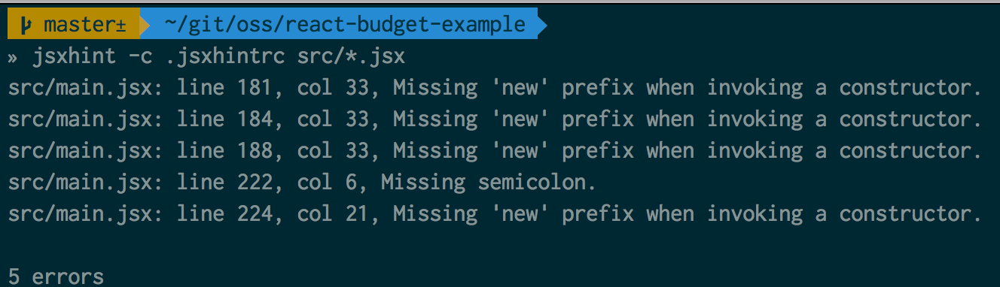
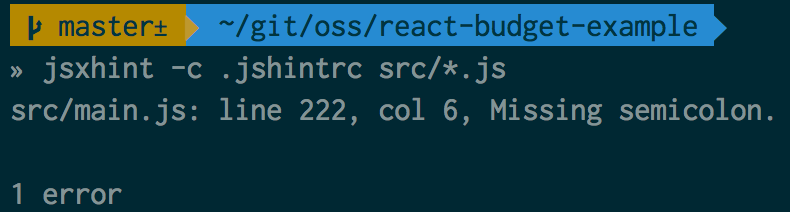
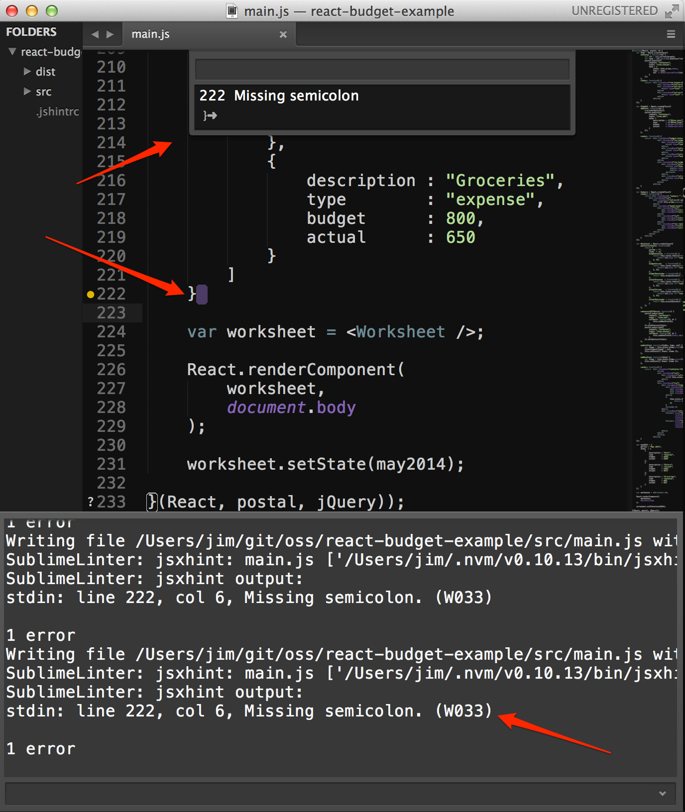
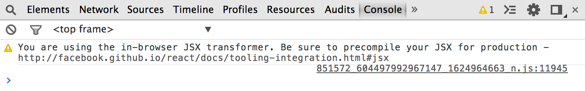
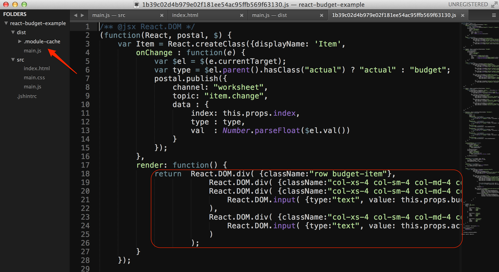

In my [last post](http://tech.pro/blog/2020/a-thrown-to-the-wolves-hands-on-introduction-to-react), we dove right into using [ReactJS](http://facebook.github.io/react/) to create an actual application - or at least *the beginnings of one*. In this post we're going to pick up where we left off and cover a few other key things you should know about if you're working with ReactJS.

## Retrieving Remote Data
In the previous post, we managed to implement the basic behavior of a single budget worksheet. However, the components only dealt with in-memory data, and that's not terribly realistic. What would it look like for our components to get their data via HTTP calls? A very rough implementation could look something like this: 

```
	// Only showing the two relevant methods from our Worksheet component.
	// The `componentWillMount` method is called before a component is rendered
	// The `getWorksheet` method is solely there to make the HTTP request
	var Worksheet = React.createClass({
        getWorksheet: function() {
            var url = "/budget/" + this.props.periodId;
            var self = this;
            $.ajax({
                url: url,
                dataType: 'json'
            }).then(function(data) {
                self.setState(data);
            });
        },
        componentWillMount: function() {
            this.getWorksheet();
            postal.subscribe({
                channel: "worksheet",
                topic : "item.add",
                callback: function(d, e) {
                    this.addNewItem(d);
                }
            }).withContext(this);
            postal.subscribe({
                channel: "worksheet",
                topic: "item.change",
                callback: function(d, e) {
                    this.updateItem(d.index, d.type, d.val);
                }
            }).withContext(this);
        },
    });
```

Let's see [this in action](http://jsfiddle.net/ifandelse/Z2FLA/):

<iframe width="100%" height="300" src="http://jsfiddle.net/ifandelse/Z2FLA/embedded/result,js,html,css" allowfullscreen="allowfullscreen" frameborder="0"></iframe>

> Heads up - I'm using [jquery-mockjax](https://github.com/appendto/jquery-mockjax) to mock HTTP endpoints in all of the fiddles for this post. However, as far as the components go, they're think they're making AJAX calls (and they are, we're just intercepting them with mockjax).
 
Ok - so that's fine. But what if you don't like baking the transport assumptions (i.e. - the fact that we're making an HTTP request, and the details involved) into your component? There are several frameworks that provide some sort of separate between the view concerns and data retrieval/transport concerns (Kendo UI's datasource or Backbone's "sync" implementation, for example). Since I'm already using [postal.js](https://github.com/postaljs/postal.js) in these examples, I'll show how a component can make a request without needing to know *how* the data retrieval is handled:

```
	// Only showing the two relevant methods from our Worksheet component.
	var Worksheet = React.createClass({
		getWorksheet: function() {
            var self = this;
            postal.channel("worksheet").request({
                topic: "read",
                data: {
                    periodId: this.props.periodId
                },
                timeout: 2000
            }).then(function(data) {
                self.setState(data);
            });
        },
        componentWillMount: function() {
            this.getWorksheet();
            postal.subscribe({
                channel: "worksheet",
                topic : "item.add",
                callback: function(d, e) {
                    this.addNewItem(d);
                }
            }).withContext(this);
            postal.subscribe({
                channel: "worksheet",
                topic: "item.change",
                callback: function(d, e) {
                    this.updateItem(d.index, d.type, d.val);
                }
            }).withContext(this);
        }
    });
```

In the above snippet, the component is making a request over postal, and another component, which is responsible for the actual AJAX calls, will handle the request and reply to the component with the data once it's been received.

Why would this *ever* be useful? By separating the data access details from the component, we now have a component that works seamlessly with HTTP requests, websockets and/or localStorage/IndexedDB, etc.

> By the way, if you want to see a fiddle showing the above request/response approach in action, it's [here](http://jsfiddle.net/ifandelse/vRq2n/).

## Mixins
One very helpful feature of ReactJS is the baked-in ability to add mixins to your components. If you have behavior that's common to several components, you can extract that behavior into a stand-alone object and then "mix it into" the component via the `mixins` property. For example, let's say that we'll have several components that will make a request for data using postal. If we refactor our approach just a bit, we can come up with a mixin that looks like this:

```
	var dataMixin = {
        requestData: function() {
            var self = this;
            postal.channel(self.props.namespace).request({
                topic: "read",
                data: {
                    id: this.props.id
                },
                timeout: this.props.timeout || 2000
            }).then(function(data) {
                self.setState(data);
            });
        }
    };
```

Then, in our `Worksheet` component, we could do this:

```
	// Only showing the two relevant methods from our Worksheet component.
	var Worksheet = React.createClass({
		mixins: [dataMixin],
        componentWillMount: function() {
            this.requestData();
            postal.subscribe({
                channel: "worksheet",
                topic : "item.add",
                callback: function(d, e) {
                    this.addNewItem(d);
                }
            }).withContext(this);
            postal.subscribe({
                channel: "worksheet",
                topic: "item.change",
                callback: function(d, e) {
                    this.updateItem(d.index, d.type, d.val);
                }
            }).withContext(this);
        }
    });

```
(See this in action [here](http://jsfiddle.net/ifandelse/zp7S4/).)

In the above snippet, we're adding the `dataMixin` to the `Worksheet` component by including it in the `mixins` array.

It might not be *immediately* apparent how this could be useful, but bear in mind this mixin is only handling *reading* data, but it would be simple to expand to to handle requests for creation, deletion and updating of data as well. This means with minimal effort, you'd have a mixin that handles de-coupled CRUD operations which you could mix into any component.

Another area where a mixin could help us in this code is in abstracting away the dependency on postal from the components (since as much as I love using message-based approaches, I don't like baking the dependency into the component). We can create a simple mixin to abstract the `publish` and `subscribe` calls:

```
	var msgMixin = {
        subscriptions: {},
        publish: function(topic, data) {
            postal.publish({
                channel: this.props.namespace,
                topic : topic,
                data : data
            });
        },
        subscribe: function(topic, callback) {
            if(!this.subscriptions[topic]) {
                this.subscriptions[topic] = postal.subscribe({
                    channel: this.props.namespace,
                    topic: topic,
                    callback: callback
                }).withContext(this);
            }
        }
    };
```

This mixin helps out on at least two fronts. First, it keeps extra boilerplate code out of our components. Second, it's general enough that I could potentially swap it out for a different messaging/eventing mix-in approach down the road. Let's see what our components looks like with this in place (see the runnable version [here](http://jsfiddle.net/ifandelse/DV4yC/)):

###The `Item` Component

```
    // Only showing affected methods
	var Item = React.createClass({
        mixins: [msgMixin],
        onChange : function(e) {
            var $el = $(e.currentTarget);
            var type = $el.parent().hasClass("actual") ? "actual" : "budget";
            var data = {
                index: this.props.index,
                type : type,
                val  : Number.parseFloat($el.val())
            };
            this.publish("item.change", data);
        }
    });
```

###The `ItemAdd` Component

```
	// Only showing affected methods
	var ItemAdd = React.createClass({
        mixins: [msgMixin],
        addItem: function(e) {
            e.preventDefault();
            var data = {
                description : $("#item_desc").val(),
                type        : $("#item_type").val(),
                budget      : Number.parseFloat($("#item_budget").val()),
                actual      : Number.parseFloat($("#item_actual").val())
            };
            this.publish("item.add", data);
        }
    });
```

###The `Worksheet` Component

```
	// Only showing affected methods
	var Worksheet = React.createClass({
		mixins: [msgMixin, dataMixin],
        componentWillMount: function() {
            this.requestData();
            this.subscribe(
                "item.add",
                function(data, env) {
                    this.addNewItem(data);
                }
            );
            this.subscribe(
                "item.change",
                function(data, env) {
                    this.updateItem(data.index, data.type, data.val);
                }
            );
        },
	});
```

In my opinion, much more readable!

## JSXHint
I was initially *very* skeptical about JSX. After all, my experience with XML earlier in my career is best summed up by this humorous quote: "*XML is like violence: if it doesn't solve your problem, you're not using enough of it.*" I was, to my surprise, quickly won over. 

However, when jshint saw JSX, it was not so thrilled. More like:


I was thrilled to discover [jsxhint](https://www.npmjs.org/package/jsxhint). In a nutshell, it wraps jshint, so that it supports JSX syntax. After npm-installing jsxhint, I tested it out on my main.js file:



I was surprised to see so many "*Missing 'new' prefix when invoking a constructor*" warnings, given that I'm usually quite consistent in only naming constructor functions with leading upper case characters. So when I investigated line 181 (the first of these errors), I saw only `<ItemAdd />` on the line. This is valid JSX as far as I understand it - I'm including the `ItemAdd` component as part of the `Worksheet`'s `render` method. Turns out, all the other instances of this warning involved including JSX components as well. 

So - it's not really an error on my part. If the warnings really bother you, you can set the `newcap` option to `false` in your `.jshintrc` file (which I did), to get less noise in the linter output:



###JSX Linting in Sublime Text 3
Command line linting is fine, but I'd *much* rather not have to context switch from my code editor to see linting results. Thankfully, someone wrote a [jsx linter plugin](https://github.com/SublimeLinter/SublimeLinter-jsxhint/) for [SublimeLinter](https://github.com/SublimeLinter/SublimeLinter3). Getting it set up in ST3 took a bit of tweaking (be sure to follow the instructions on the [README](https://github.com/SublimeLinter/SublimeLinter-jsxhint/)), but once I had it running, it was seamless. I had mine set to lint on save - you can see that jsxhint notifies you with the error report (top), inline in the code as well as in ST3's console:




## JSX precompiling
Up until now I've been letting my JSX compile on-the-fly when the page is rendered. This is fine for development practices, but definitely not a good production practice. In fact, you'll see a warning in your browser console if you're compiling on-the-fly:



To precompile your JSX, you need to use [react-tools](https://www.npmjs.org/package/react-tools) (which requires node.js).

###Easy, One-Time Compilation
In this example, my JSX is contained within `src/main.js`. If I'm in my project's root directory and I want to compile the output to a `dist` folder, I can run this on the command line: `jsx src dist`. I noticed right away that it created a `.module-cache` directory in the output folder - so it's a good idea to add that to your .gitignore. In this screenshot you can not only see that the output file was generated, but you also get a glimpse at what JSX looks like once converted to JavaScript:



###Auto-compiling As You Write Code
It's quite simple to compile your JSX to JavaScript *as you write your code*. In my case, I just needed to run this in my console: `jsx --watch src dist`.

###Auto-compiling on Build-Tool-Steroids

The `jsx --watch` option is definitely helpful - but I'd prefer to make the auto-compilation of JSX to be part of the rest of my build tool chain. In my case, I've been using [gulp.js](http://gulpjs.com/) quite a bit, and it turns out that the incredibly prolific [Sindre Sorhus](https://github.com/sindresorhus) has written the [gulp-react](https://www.npmjs.org/package/gulp-react) plugin, which will enable me include JSX compilation as part of my build setup. Here are the relevant snippets for doing so from my `gulpfile`:

```
// The task to compile the jsx, etc.
gulp.task('build-jsx', function(){
    return gulp.src('src/*.js')
        .pipe(react())
        .pipe(uglify({ "reservedNames" : "postal,React"}))
        .pipe(rename("main.min.js"))
        .pipe(gulp.dest('dist'));
});

// Watch task triggers jsx task when js files change
gulp.task('watch', function(){
    var server = livereload();
    gulp.watch('src/*.js', ['build-jsx']);
    gulp.watch('src/*.css', ['minify-css']);
    gulp.watch('src/*.html', ['clean-html']);
    gulp.watch('dist/**').on('change', function(file) {
      server.changed(file.path);
  });
});
```

(You can see the full `gulpfile` [here](https://github.com/ifandelse/react-budget-example/blob/master/gulpfile.js).)

With gulp-react integrated into my gulp setup for this project, I only need to run `gulp` in the root directory of my project (and enable livereload in Chrome), and I have a full CI setup running. Any changes to my `src` directory will ultimately result in my browser reloading to reflect the updates - JSX compilation included.

If you're a [grunt](http://gruntjs.com/) user, don't worry! You can use the [grunt-react](https://www.npmjs.org/package/grunt-react) task to make JSX compilation part of your grunt workflow as well. In fact, there's a [list of complementary tools](https://github.com/facebook/react/wiki/Complementary-Tools) on the ReactJS Github Repo, including tools to help in working with [browserify](http://browserify.org/), [RequireJS](http://requirejs.org/), [meteor](https://www.meteor.com/) and a lot more.

## What's Next?

Well, first - *go play with React* and have fun!

If you're interested in seeing what the changes we applied to our example project look like, you can pull down the [tagged version here](https://github.com/ifandelse/react-budget-example/releases/tag/v0.2.0).

In the future I hope to continue expanding our example app by supporting multiple worksheets, adding transitions, client-side routing, server-side rendering of JSX in node.js and more. Stay tuned!


