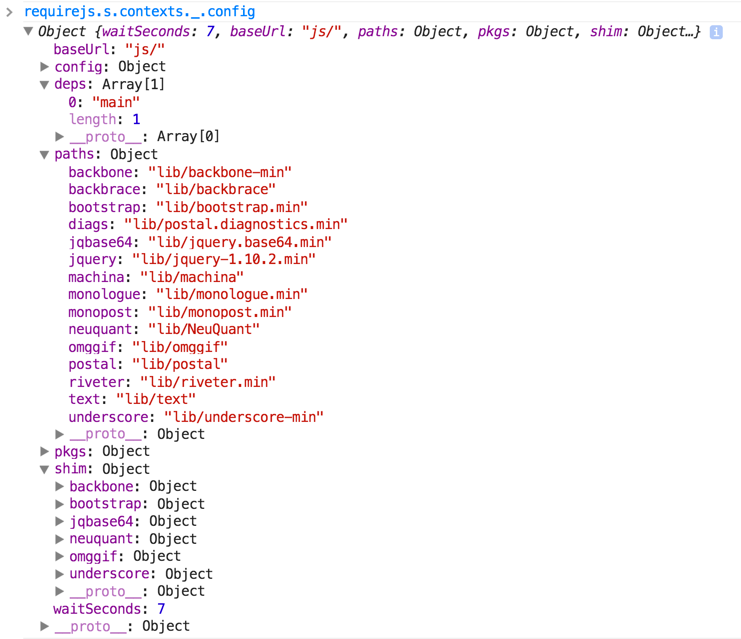

RequireJS – a "JavaScript file and module loader" – is a powerful way to organize, manage, build and load JavaScript in your web application. I've been using RequireJS for a couple of years and while it's admittedly difficult to limit myself to *only* five, these five tips are things I really wished I'd known sooner rather than later. I'm assuming you have *some* knowledge of RequireJS, or at least are aware of what AMD, CommonJS and script loaders are.

In this post we're going to focus on using RequireJS itself, and not r.js (the optimizer). (I plan to write a follow up post on using r.js.)

## 1.) Know Your Options When Defining Modules
Most people using RequireJS are familiar with this approach of defining a module:

    define(["dependencyA", "dependencyB"], function(depA, depB) {
        /* module code here using depA and depB */
        return myModule;
    }

98% of the time, I use the above approach. However - you have some other choices, depending on your needs. Have a module that takes no dependencies? If so, you can do this:

    define({
        someProp: "Oooh, how interesting!",
        someMethod: function() {
            // do interesting work
            return compellingValue;
        }
    });

Have a module that takes no dependencies, but you need to perform some sort of setup work (or store private state)? You can do this:

    define(function() {
        var secretValue = "seekret";
        // do other initialization work here...
        return {
            someProp: "Oooh, how interesting!",
            tellMeSecrets: function() {
                // do interesting work
                return secretValue;
            }
        };
    });

## 2.) How to Work with Non-AMD Libs
There are a ton of great JavaScript libraries out there - the majority of which don't follow the AMD spec. But don't worry - that doesn't have to keep you from using them! Since RequireJS 2, the "shim" feature has been available, allowing you to tell RequireJS about non-AMD modules that you'd like to use inside your application and load as dependencies into other AMD modules. Let's look at a couple of examples of shimming non-AMD libs.

You might remember the drama that ensued when Backbone and Underscore [removed AMD support](https://github.com/jashkenas/underscore/pull/431#issuecomment-3452856). Thanks to the shim feature, it's still possible (and easy) to use a library like Underscore with RequireJS:

    require.config({
        paths: {
            underscore : "libs/underscore.min"
        },
        shim : {
            underscore : {
                exports : "_"
            } 
        }
    });

You can see in the above `require.config` call that we are providing a path to a minified underscore.js. Below that, on the `shim` object, we add a property that matches the name of the path we added (`underscore`). The value for this property is an object that, at least, provides an `exports` member, which tells RequireJS what member on the global object (the window, assuming you're in a browser, of course) is the actual module value. Since Underscore adds itself to the `window` as "_", then we make our `exports` value "_". From now on, if an AMD module requires Underscore as a dependency, RequireJS will provide the "_" value that appeared on the global object.

That's an easy example, though, since Underscore doesn't have any dependencies of its own. How do we shim a non-AMD library that takes dependencies? Let's look at how we'd do this for Backbone, since it depends on Underscore and jQuery:

    require.config({
        paths: {
            jquery     : "libs/jquery.min",
            backbone   : "libs/backbone.min",
            underscore : "libs/underscore.min",
        },
        shim : {
            underscore : {
                exports : "_"
            },
            backbone : {
                deps    : [ "jquery", "underscore" ],
                exports : "Backbone"
            }
        }
    });

Our shim configuration for Backbone has a `deps` property in addition to `exports`. The `deps` member is an array containing the dependency names which should be loaded before Backbone is loaded. Once those dependencies are loaded, Backbone itself will be loaded, and then RequireJS will grab the `Backbone` member from the global object and use that as the `backbone` module value.

####What about CommonJS modules?
Have a CommonJS module that you'd like to use with RequireJS? No problem - you can do something like this:

    define(function(require, exports, module){
        var cjs = require('myCommonJSModule');
        return {
            findDroids: function( droids ) {
                var res = [], i = 0, len = droids.length;
                for( ; i < len; i++ ) {
                    if( cjs.isDroidWeAreLookingFor( droids[i] )) {
                        res.push(droids[i]);
                    }
                }
                return res;
            }
        };
    });

Just be aware that if your CommonJS module has branching logic that conditionally invokes `require`, then the above approach will *not* work. For example, if the `myCommonJSModule` above had this internally:

    // inside myCommonJSModule
    module.exports = {
        isDroidWeAreLookingFor : function( droid ) {
            var finder;
            // OHSNAP! The conditional logic around "require"
            // means we can't wrap it with "define" in RequireJS
            if(isObiWanPresent) {
                finder = require('forceFilter');
            } else {
                finder = require('normalTrooper');
            }
            return finder.find( droid );
        }
    }

## 3.) CDN Fallbacks
While using a Content Delivery Network can give your site performance advantages, you don't want your site to be broken & unusable in the event that the CDN is unreachable. Thankfully, RequireJS makes it very easy to provide fallback paths. A normal path configuration might look something like this:

	require.config({
		paths: {
			kendoui : "http://cdn.kendostatic.com/2013.2.716/js/kendo.all.min.js"
		}
	});

Of course, we hope that the Kendo UI CDN never goes down, but if it does, we can fall back to a different path by modifying our configuration to look like this:

	require.config({
		paths: {
			kendoui : [
				"http://cdn.kendostatic.com/2013.2.716/js/kendo.all.min",
				"libs/kendoui/kendoui.min"
			]
		}
	});
	
With the above configuration, RequireJS will attempt to load the file from the CDN first. If that fails, it will attempt the second path. It's true that falling back will add time to how long your script takes to load, but it beats an unusable site!

## 4.) Plugins!
Perhaps one of the nicest value-adds for RequireJS is the use of loader plugins. Loader plugins provide support for various non-JavaScript assets - allowing you to require them as dependencies like any other module (for the most part). Arguably the most popular is the ["text"](http://requirejs.org/docs/api.html#text) plugin - which allows you to load plain text file dependencies (think HTML & CSS, etc.). This can be incredibly useful for loading templates. To understand *how* it can be useful, let's look at the approach many people use today:

This snippet shows a Backbone view retrieving the contents of an underscore.js template, pre-compiling it, and using it for rendering - without RequireJS/text in the mix:

var MyView = Backbone.View.extend({
	initialize: function() {
		this.template = _.template( $( "generated-gif-template" ).text() );
	},
	render : function() {
		this.$el.html( this.template( this.model.toJSON() ));
	}
});

You'll notice that this view expects the template to be *in the page*. Many people add a `script` element, giving it a fake `type` (so that it's not evaluated), and place the template content inside it, like this:

	
	
Sure - this approach is do-able, but it has a few drawbacks:

* You lose syntax highlighing and other IDE features when nesting template markup inside a `script` tag.
* The template must be present *any* in which it's used. In a multi-page site, this means you either have multiple copies of the template floating around, or a custom build step that concats templates into each target HTML page.
* In an AMD app, storing a template in the DOM like this means that your module actually *has a dependency on something that isn't explicitly passed to it*. This makes your code brittle and easily breakable. Ideally, we'd like to have the template passed to our module like any other dependency. 

That's where the "text" plugin comes in:

	define([
		'backbone',
		'text!templates/generated-gif.html'
	], function( Backbone, template ){
		return Backbone.View.extend({
			initialize: function() {
				this.template = _.template( template );
			},
			render : function() {
				this.$el.html( this.template( this.model.toJSON() ));
			}
		});
	});
	
You can see above that we've included the path to our template, preceded with `text!` (which tells RequireJS to use the loader plugin by the name of "text"). The text content of the template is passed into module as the `template` argument. We gain a few things by taking this approach:

* Our templates can live *in their own files* during development, allowing us the benefits of our IDE features (syntax highlighting, etc.), *and* preventing us from having to scour hundreds (or more) lines of combined markup files looking for the correct `script` tag to edit.
* Our templates can be treated like any other module asset - so passing them explicitly into a module makes it very clear that the module depends on that template (as opposed to hoping it exists in the DOM when the module executes).
* When we use [r.js](http://requirejs.org/docs/optimization.html) to build & optimize our RequireJS app, the templates can be concatenated & deployed along with all of our other modules - since the text plugin effectively wraps the template in a module `define` call, creating a module which returns the text value of the file.

That's just a quick glance at *one* plugin. You can see a list of other plugins [here](https://github.com/jrburke/requirejs/wiki/Plugins). To whet your appetite, consider some of these:

* [i18n](http://requirejs.org/docs/api.html#i18n) - localization
* [image](https://github.com/millermedeiros/requirejs-plugins) - allows you to load images like modules
* [mdown](https://github.com/millermedeiros/requirejs-plugins/) - allows you to load markdown (it compiles it to HTML for you)
* [font](https://github.com/millermedeiros/requirejs-plugins) - allows you to load web fonts like modules

## 5.) Some Tricks for Troubleshooting
You can use these API calls in your code if you need to, but I've actually found them quite useful when on the console in chrome:

* `require.defined(moduleId)` - returns true if your `moduleId` has been defined and is ready for use.
* `require.specified(moduleId)` - returns true if your `moduleId` has been listed as a dependency by another defined module. Note that just because this returns true doesn't mean your `moduleId` is ready to use (don't you just love asynchrony?).
* `requirejs.s.contexts._.config` - this is technically a "back door/undocumented" call - so *it could change or disappear without warning*. However it returns a very useful object full of configuration info, see below:

This is the result of calling `requirejs.s.contexts._.config` inside a [sample gif-generation app](https://github.com/ifandelse/gif-stitch) I used to demo [Web Workers](https://developer.mozilla.org/en-US/docs/Web/API/Worker) at [Devlink](http://www.devlink.net/). You can see all the relevant configuration data: the base URL, the paths we've mapped, the shim configuration, etc.

Two other key items to know about when it comes to troubleshooting RequireJS are 'errbacks' and the `requirejs.onError` method:

###RequireJS "errbacks"
When you make a `require` call, you can inlcude a third argument - a callback that receives an error argument, allowing you to react to the error, instead of ultimately generating an uncaught exception. The method signature, when using "errbacks" looks like this:

	require(
		[ "backbone" ], 
		function ( Backbone ) {
	    	return Backbone.View.extened({ /* your magic here */ });
		}, 
		function (err) {
			/* 
				err has err.requireType (timeout, nodefine, scripterror)
				and err.requireModules (an array of module Ids/paths)
				
				Inside here you could requirejs.undef('backbone') to clear
				the module from require locally - and you could even re-define
				it here or fetch it from a different location (though the
				fallback approach earlier takes care of this use-case more succinctly)
			*/
		}
	);
	
###requirejs.onError
RequireJS has a global onError handler that will catch any errors not already handled by "errbacks". To use it, simply set it like this:

	requirejs.onError = function (err) {
		/* 
			err has the same info as the errback callback:
			err.requireType & err.requireModules
		*/
	    console.log(err.requireType);
	    // Be sure to re-throw if you don't want to
	    // blindly swallow exceptions here!!!
	};

##Wrapping Up
There you have it - a handful of tips that you'll find useful whether you're just getting started with RequireJS, or are an experienced user. As I mentioned earlier, I'm saving [r.js]() for a dedicated article - so keep an eye out for it. Are there any particular tips, approaches, APIs, etc. that you've found useful when using RequireJS? I'd love to hear about them!