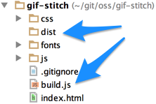
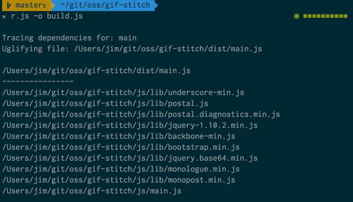
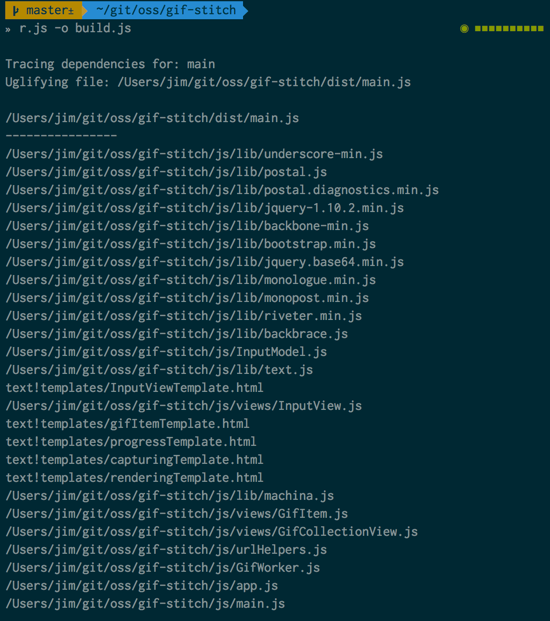
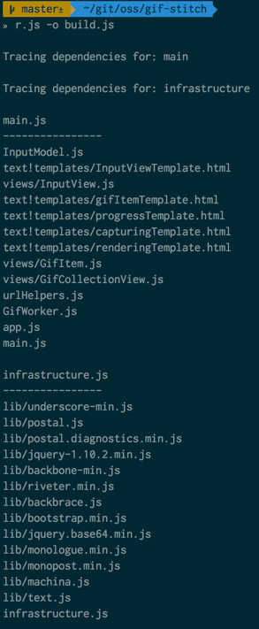
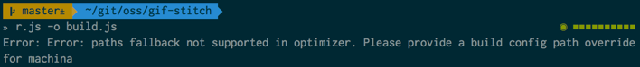
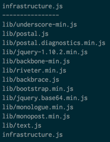
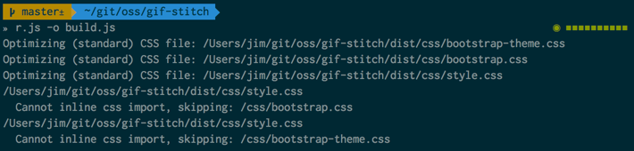

Once you learn the general concepts behind AMD (Asynchronous Module Definition) and RequireJS, it's not difficult to start using it in your projects. You might even go a bit further than the basics and start using some of the great loader plugins available for RequireJS (the ["text"](http://requirejs.org/docs/api.html#text) plugin for templates, for example). However, what exactly should you do with all these individual JavaScript files when the time comes to deploy your application to production? You *know* you can't just toss 30 or 40 modules into the wild – *each in individual files* – and expect your site to perform optimally. No worries - that's where [r.js](http://requirejs.org/docs/optimization.html) comes into play. We'll examine a lot of what you can do with r.js in this post. (I'm assuming you're familiar with RequireJS - if not, you might be interested in reading [this](http://tech.pro/blog/1561/five-helpful-tips-when-using-requirejs) or [this](http://blog.safaribooksonline.com/2013/09/26/getting-started-with-requirejs-and-amd/) first.)

> Throughout this post, I'll be using a project of mine called ["gif-stitch"]() as the "guinea pig" for r.js optimization examples.

##The RequireJS Optimizer
When you use RequireJS on a project, the very things that give you an advantage in the development/testing/debugging experience – separate files per module, unminified source, etc. – become weaknesses in a production deployment. At the highest level, r.js optimizes your RequireJS projects by concatenating & minifying your JavaScript modules and CSS files. So you get the best of both worlds - tailored-to-development *and* tailored-to-production scenarios. It's *incredibly* configurable - you can go as simple as combining your modules (without minifying), all the way to customizing the output into multiple combined modules, integrating CDN resources and more.

##Installing r.js
99.999% of the time you will be using node.js and your command prompt to run r.js. (You can [check the documentation](http://requirejs.org/docs/optimization.html#requirements) for more information about the other environments in which you can run r.js.) To install r.js using node, you just need to run this in your terminal/command prompt:

	npm install -g requirejs

##Using r.js

###Command Line Usage
Again, I'll argue that 99.999% of the time, you'll use a "build.js" file (containing any necessary metadata for r.js to consume), as opposed to passing options on the command line. When you use a build file, most of the time the only command line option you need to pass is the build file to use:

*(using node to run r.js & telling r.js to use the "build.js" file in the current directory for build-related metadata):*

	r.js -o build.js

You can override options in your "build .js" file by including them on the command line (since command line arguments take precendence). The [r.js docs](http://requirejs.org/docs/optimization.html#basics) cover this in a bit more detail.

###Programmatic Usage
It's worth mentioning that the r.js module installed via node.js includes an API which can be used inside other node modules. (You can read more about that [here](http://requirejs.org/docs/node.html#optimizer).) This is especially useful if you are using any JavaScript-based build tools like [anvil.js](http://anviljs.com/) or [grunt](http://gruntjs.com/), since it allows you to easily incorporate r.js into your build process. (You can still incorporate r.js into non-JavaScript build processes, you'll typically be using a CLI-based approach instead.)

##Putting it to Work
So, let's pretend I've never optimized the project I mentioned at the start of the post ("gif-stich") – because I actually haven't. :-)

###Creating a Build File
The first thing I need to do is add a "build.js" file to my project. We'll start with this:

	({
	    paths: {
	        backbone   : "lib/backbone-min",
	        backbrace  : "lib/backbrace",
	        bootstrap  : "lib/bootstrap.min",
	        jquery     : "lib/jquery-1.10.2.min",
	        jqbase64   : "lib/jquery.base64.min",
	        machina    : "lib/machina",
	        monologue  : "lib/monologue.min",
	        monopost   : "lib/monopost.min",
	        neuquant   : "lib/NeuQuant",
	        omggif     : "lib/omggif",
	        postal     : "lib/postal",
	        diags      : "lib/postal.diagnostics.min",
	        riveter    : "lib/riveter.min",
	        text       : "lib/text",
	        underscore : "lib/underscore-min"
	    },
	
	    shim : {
	        backbone : {
	            deps : ["jquery", "underscore"],
	            exports : "Backbone"
	        },
	        bootstrap : {
	            deps : ["jquery"]
	        },
	        jqbase64 : {
	            deps : ["jquery"],
	            exports : "jQuery"
	        },
	        neuquant : {
	            exports : "NeuQuant"
	        },
	        omggif : {
	            exports : "GifWriter"
	        },
	        underscore : {
	            exports : "_"
	        }
	    },
	
	    baseUrl : "js",
	    name: "main",
	    out: "dist/main.js",
	    removeCombined: true
	})

A few things to note about the above configuration:

* I've included my `paths` settings used by the app itself as well as the `shim` setup for non-AMD libraries.
* I've specified a baseUrl (all modules are located relative to this path - an important fact, since the build.js file is in the project's root directory).
* I've used the `name` property to tell r.js which module I want to optimize: the `main.js` module.
* The `out` property tells r.js that the optimized output should go into the `dist` folder - using the same module name of `main.js`.
* r.js will normally copy the *stand-alone* versions of concatenated modules to the output directory in addition to the combined output. I don't want those files muddying up my `dist` directory. I can prevent this by setting the `removeCombined` option to `true`.

So - I've saved the above file as `build.js` in the root of my project, and made sure I have a `dist` directory:

###Running r.js

Next - we'll run r.js in the terminal:

From the screenshot above you can see we ran `r.js -o build.js`, and r.js was nice enough to tell us what it was doing as it optimized the project. You can see that it started with the `main.js` module, "traced it's dependencies" (more on that in a second), and it lists the files it's concatenating/minifying as it processes them. Great. But there's a HUGE problem here. 

###Tweaking the Build File
So what's the problem? I only see the main.js module and the 3rd party dependencies in my `lib` directory. However, main.js module requires the `app.js` module as well - and by including `app.js`, I should see the *rest of the modules in the project* listed here as well. What happened? Let's look at the relevant snippet from main.js:

	require( [ "diags", "backbone", "bootstrap", "jqbase64", "monopost" ], function () {
		require( [ "app" ], function ( app ) {
			app.init();
		} );
	} );
	
It looks like r.js honored the first `require` call as it traced `main.js`'s dependencies- the one that includes "diags", "backbone", "bootstrap", etc., but ignored the second `require` call that pulls in the `app.js` module. As it turns out, that's *exactly* what happened. r.js will assume that "nested" `require` calls are intended to happen at runtime, unless you tell it otherwise.

We can tell r.js to look for those nested `require` calls by adding `findNestedDependencies: true` to our `build.js` configuration. But let's not stop there. One of the things I hate about our `build.js` file at the moment is that it's *duplicating the path and shim* configuration we use in our `main.js` module. Wouldn't it be great if we could just re-use that? We can! Our `build.js` just needs to look like this:

	({
	    mainConfigFile : "js/main.js",
	    baseUrl : "js",
	    name: "main",
	    out: "dist/main.js",
	    removeCombined: true,
	    findNestedDependencies: true
	})

So, in addition to adding the `findNestedDependencies` property, we've added the `mainConfigFile` property, passing the path to our `main.js` module as the value. r.js will look for the first `requirejs({})`, `require({})`, `requirejs.config({})` or `require.config({})` call in our `main.js` module and use that. 

Here's the output of running with our tweaked `build.js`:

Now we're talking! We can see that more than just our `lib` directory and `main.js` modules were optimized. Not only that - our templates were optimized as well, since we're using the "text" loader plugin. 

###Still Not Satisfied
Sure, what we have so far works. If we wanted to stop here (we don't, trust me), all we have to do is change our main `script` element to look like this:

<pre class="prettyprint linenums">
&lt;script src="js/lib/require.js" data-main="dist/main"&gt;&lt;/script&gt;
</pre>

This isn't going to win any medals at the AMD fair (I know, but there *should* be one, really :-)). There are several things I'd want to change:

* We've bundled *everything* into one file. This isn't necessarily bad, but I might want to separate our modules into the following groups:
    * app modules (files directly related to the features of the app)
    * 3rd party modules
    * 3rd party modules available on CDN
* Our require.js and main.js files are in two different directory trees - the `js` directory is obviously our "development" area, and `dist` is production. It would be a good idea to have our production assets all in `dist` in this case.
* We haven't optimized our CSS yet.

Let's tackle these one step at a time.

### Going From One Combined File to Multiple Files
In our `build.js` file, we've used the `name` and `out` properties to indicate a single starting point (`name: "main"`) and a single output file (`out: "dist/main.js"`). Now we get to change things up a bit and fine-tune how we're combining modules.

r.js supports a `modules` property in our `build.js` file - which let's us specify an array of output files, instead of being limited to one. So, let's take the goals I mentioned above, and tailor how our files are combined.

####Generating a Combined File With Only App Modules
Here's the modified `build.js`:

	({
	    mainConfigFile : "js/main.js",
	    baseUrl: "js",
	    removeCombined: true,
	    findNestedDependencies: true,
	    dir: "dist",
	    modules: [
	        {
	            name: "main",
	            exclude: [
	                "backbone",
	                "backbrace",
	                "bootstrap",
	                "jquery",
	                "jqbase64",
	                "machina",
	                "monologue",
	                "monopost",
	                "neuquant",
	                "omggif",
	                "postal",
	                "diags",
	                "riveter",
	                "text",
	                "underscore"
	            ]
	        }
	    ]
	})

You can see from the above snippet that we've removed the `name` and `old` properties and added `dir` (indicating our output directory) and `modules`. The `modules` array (for now) only contains an output module definition for our `main` module. The `name` property of the first module in the array indicates that we want to concatenate our `main.js` module & its dependencies, and the `exclude` array includes a list of modules that should *not* be included in the concatenated output.

If we examine our `dist` directory after running r.js with this configuration, we'd see the following:

	dist/
		lib/
			backbone-min.js
			backbone-min.map
			backbrace.js
			bootstrap.min.js
			jquery.base64.min.js
			machina.js
			monologue.min.js
			monopost.min.js
			NeuQuant.js
			omggif.js
			postal.diagnostics.min.js
			postal.js
			require.js
			riveter.min.js
			text.js
			underscore-min.js
			underscore-min.map
		templates/
			capturingTemplate.html
			gifItemTemplate.html
			InputViewTemplate.html
			progressTemplate.html
			renderingTemplate.html
		build.txt
		main.js
		omggif-worker.js

A few observations:

* You'll notice that our templates were copied into the `dist` directory (including the source maps we had in the project). They were *also* concatenated into module wrappers and combined into the `main` module output. The templates will be pulled from the combined `main` module, not from the copied templates directory. It's quite common (if you're using the "text" loader plugin), to remove these copied templates as part of your build process.
* You'll also notice that the remaining modules (everything we excluded) were copied to the `dist/lib` directory (they were also minified).
* You might also notice that a `build.txt` file was created - it contains the output you also see on the command line. 
 
Great - that's a start in the right direction.

####Creating a Combined File for Third Party Dependencies
Remember all those modules we excluded from our combined `main` module? Let's assume we'd like to bundle them into a combined module as well. (The assumption might be that our app code – everything we combined into our `main` module – will change more frequently than our 3rd party dependencies, and we'd like to be cognizant of caching.) There are a couple of ways we can accomplish this:

* We could add a module output definition to our `modules` array which combines our 3rd party modules under a file name that gets loaded *first* (`diags`, in this case, if you refer to the very first module required in our `main` module). 
* Or we could admit that the above idea is horrible (& brittle), and instead create a "loader module" that our `main` module requires as a dependency. For example, we'd change our `main` module's `require` call to look like this:

	require( [ "infrastructure" ], function () {
		require( [ "app" ], function ( app ) {
			app.init();
		} );
	} );

Next, we'd create an `infrastructure.js` file that looks like this:

	define([
	    "diags",
	    "backbone",
	    "backbrace",
	    "bootstrap",
	    "jqbase64",
	    "monopost",
	    "machina",
	    "text"
	], function() { });

Our `infrastructure` module has no real behavior of it's own, other than ensuring that our "infrastructure" libraries are loaded. This provides not only a module to easily *exclude* from what gets included in the `main` module's output, but an easy module for r.js to crawl to find all the infrastructure-related dependencies (our 3rd party libraries). Here's our modified build file:

	({
	    mainConfigFile : "js/main.js",
	    baseUrl: "js",
	    removeCombined: true,
	    findNestedDependencies: true,
	    dir: "dist",
	    modules: [
	        {
	            name: "main",
	            exclude: [
	                "infrastructure"
	            ]
	        },
	        {
	            name: "infrastructure"
	        }
	    ]
	})

The console output after running r.js with this configuration will look like this:

Great! This is a good step forward. Our `build.js` file is a bit cleaner with the `infrastructure` module involved, and we now have two files of selected combined modules. What if we want to pull some of the 3rd party dependencies from a CDN?

####Allowing for CDN-based Resources
Let's assume I want to pull machina.js from [cdnjs](http://cdnjs.com/), and also allow a fallback to a local path. First thing to change is our `paths` configuration in our `main.js` module:

	require.config({
	
		paths: {
			backbone   : "lib/backbone-min",
			backbrace  : "lib/backbrace",
			bootstrap  : "lib/bootstrap.min",
			jquery     : "lib/jquery-1.10.2.min",
			jqbase64   : "lib/jquery.base64.min",
			machina    : [ "http://cdnjs.cloudflare.com/ajax/libs/machina.js/0.3.4/machina.min", "lib/machina" ],
			monologue  : "lib/monologue.min",
			monopost   : "lib/monopost.min",
			neuquant   : "lib/NeuQuant",
			omggif     : "lib/omggif",
			postal     : "lib/postal",
			diags      : "lib/postal.diagnostics.min",
			riveter    : "lib/riveter.min",
			text       : "lib/text",
			underscore : "lib/underscore-min"
		},
	
		// MORE CONFIG HERE
	});
	
	// REQUIRE OUR MODULES, ETC.

Only problem is, if we try to run r.js, we will see the following error:

Not a problem. We can provide a path override for the `machina` module. When you want to let r.js resolve a dependency to a path, but *prevent* it from being included in the concatentated output, you can use the value of "empty:". For example:

	({
	    mainConfigFile : "js/main.js",
	    baseUrl: "js",
	    removeCombined: true,
	    findNestedDependencies: true,
	    dir: "dist",
	    modules: [
	        {
	            name: "main",
	            exclude: [
	                "infrastructure"
	            ]
	        },
	        {
	            name: "infrastructure"
	        }
	    ],
	    paths: {
	        machina: "empty:"
	    }
	})

If we examine our console output when we run this build, we'll see that `machina` is no longer listed in the modules that were concatenated into the `infrastructure` module:

`machina` is now being pulled from [cdnjs](http://cdnjs.com/) (and falling back to the local `lib/machina` if the CDN is down). So - modules directly related to app features all combined and minified into one file? Check. Third party (and hopefully less-frequently-changing) modules combined and minified into another file? Check. CDN resources? Check.

But we're not done. Let's look at what we can do with our css.

###Optimizing CSS
We have three CSS files in this project:  

	<link rel="stylesheet" type="text/css" href="css/bootstrap.css">
	<link rel="stylesheet" type="text/css" href="css/bootstrap-theme.css">
	<link rel="stylesheet" type="text/css" href="css/style.css">

If we'd like to *attempt* to produce a single concatenated CSS output file, we can remove the bootstrap references from our `index.html` and import them, instead, inside `style.css`:

	@import url('/css/bootstrap.css');
	@import url('/css/bootstrap-theme.css');
	
	/* style.css content here…. */

You might have caught the fact that I said "attempt" - that's because it's not always possible to "inline" CSS files inside of another in place of an import statement. In fact, that's the case with this sample app (note the output stating "Cannot inline css import…"):

This isn't a show-stopper in our case. Our `@import` statements still work, and the CSS in all three of our CSS files will be inlined inside their own files.

So - what does our `build.js` look like now?

	({
	    mainConfigFile : "js/main.js",
	    appDir: "./",
	    baseUrl: "js",
	    removeCombined: true,
	    findNestedDependencies: true,
	    dir: "dist",
	    optimizeCss: "standard",
	    modules: [
	        {
	            name: "main",
	            exclude: [
	                "infrastructure"
	            ]
	        },
	        {
	            name: "infrastructure"
	        }
	    ],
	    paths: {
	        machina: "empty:"
	    }
	})

You'll notice two new additions:

* `appDir` - this tells r.js the top level directory that contains our entire app/project. Up until now we'd only been optimizing JavaScript - but we've moved on to bigger and better things by including CSS - so we're targeting our whole project.
* `optimizeCss` - this property can be one of five values:
	* `none` - as you'd expect, no CSS optimization will occur
    * `standard` - tries to inline imports, removes comments and line endings
    * `standard.keeplines` - just like standard, but doesn't remove line endings
    * `standard.keepComments` - keeps comments, but removes line endings
    * `standard.keepComments.keeplines` - keeps comments and line endings
    
It's important to note that now that we're optimizing CSS, and using the `appDir` property, our `dist` folder is now entirely a "built" version of the project, not just the project's JavaScript. Here's what the directory looks like (after I removed the templates directory as well as the build.txt & build.js files):

	dist/
		css/
			bootstrap.css
			bootstrap-theme.css
			style.css
		fonts/
			glyphicons-halflings-regular.eot
			glyphicons-halflings-regular.svg
			glyphicons-halflings-regular.ttf
			glyphicons-halflings-regular.woff
		js/
			lib/
				backbone-min.map
				jquery-1.10.2.min.map
				machina.js
				NeuQuant.js
				omggif.js
				require.js
				underscore-min.map
			infrastructure.js
			main.js
			omggif-worker.js
		index.html

Running the app from the `dist` directory, at this point, works without any issues. We've come a long way in a short amount of time in optimizing our RequireJS setup. Let's take a quick look at a couple of additional features possible with r.js.

###Other Features
####Shallow Exclusion
While developing your app, you might prefer to have performance closer to production quality - and accomplish this by running r.js and using the combined (but un-minified) file(s) to run your dev environment. However - what can you do if one of your modules has a bug? You certainly don't want to debug a combined module if you don't have to. r.js allows you to exclude that one module (but *not* its dependencies) from being concatenated with the rest. For example, what if we wanted to prevent our `InputView` module from being concatenated with our `main` module? Our `build.js` file would look like this:

	({
	    mainConfigFile : "js/main.js",
	    appDir: "./",
	    baseUrl: "js",
	    removeCombined: true,
	    findNestedDependencies: true,
	    dir: "dist",
	    optimize: "none",
	    optimizeCss: "standard",
	    modules: [
	        {
	            name: "main",
	            exclude: [
	                "infrastructure"
	            ],
	            excludeShallow : [
	                "views/InputView"
	            ]
	        },
	        {
	            name: "infrastructure"
	        }
	    ],
	    paths: {
	        machina: "empty:"
	    }
	})

This results in our `dist` directory looking like this: 

	dist/
		css/
			bootstrap.css
			bootstrap-theme.css
			style.css
		fonts/
			glyphicons-halflings-regular.eot
			glyphicons-halflings-regular.svg
			glyphicons-halflings-regular.ttf
			glyphicons-halflings-regular.woff
		js/
			lib/
				backbone-min.map
				jquery-1.10.2.min.map
				machina.js
				NeuQuant.js
				omggif.js
				require.js
				underscore-min.map
			views/
				InputView.js
			infrastructure.js
			main.js
			omggif-worker.js
		index.html

Our `InputView` module appears as a stand-alone file - easy for us to debug without having to search through the combined output of the `main` module.

####Generating Source Maps
It's currently an experimental feature, but r.js supports generating source maps for your minified modules. *(Note: This only works for mapping minified JavaScript to the un-minified source - so no source-mapping for transpiled JavaScript.)* To enable this option, simply add `generateSourceMaps: true` to the `build.js` file:

	({
	    mainConfigFile : "js/main.js",
	    appDir: "./",
	    baseUrl: "js",
	    removeCombined: true,
	    findNestedDependencies: true,
	    dir: "dist",
	    optimize: "none",
	    optimizeCss: "standard",
	    modules: [
	        {
	            name: "main",
	            exclude: [
	                "infrastructure"
	            ]
	        },
	        {
	            name: "infrastructure"
	        }
	    ],
	    paths: {
	        machina: "empty:"
	    },
	    generateSourceMaps: true
	})

The resulting `dist` directory would include source maps for the `main` and `infrastructure` modules:

	dist/
		css/
			bootstrap.css
			bootstrap-theme.css
			style.css
		fonts/
			glyphicons-halflings-regular.eot
			glyphicons-halflings-regular.svg
			glyphicons-halflings-regular.ttf
			glyphicons-halflings-regular.woff
		js/
			lib/
				backbone-min.map
				jquery-1.10.2.min.map
				machina.js
				NeuQuant.js
				omggif.js
				require.js
				underscore-min.map
			infrastructure.js
			infrastructure.js.map
			main.js
			main.js.map
			omggif-worker.js
		index.html
		
###So Much More…
There's still quite a bit more you can configure r.js to handle for you: injecting define wrappers, choosing between uglify, uglify2 or closure for minifying your code, translating CommonJS modules to AMD, utilizing pragmas, choosing a default locale to include in a build when using the i18n plugin and more. I recommend reading through the [documentation](http://requirejs.org/docs/optimization.html) to get more familiar with the options we haven't covered. However, the best resource (IMO) for diving into the configuration options for r.js is [this sample build file](https://github.com/jrburke/r.js/blob/master/build/example.build.js). You'll find yourself referring to it *a lot*. 

Happy optimizing!