#Your First Cordova App

>tl;dr - Fasten your seat belts! We're going to take a whirlwind tour of what it's like to get off the ground writing mobile apps with [Adobe PhoneGap](http://phonegap.com/) and [Telerik Icenium](http://www.icenium.com/)) (both based on [Apache Cordova](http://cordova.apache.org/)).

If you're doing any kind of mobile development, then odds are you've heard of [PhoneGap](http://phonegap.com/). PhoneGap/[Apache Cordova](http://cordova.apache.org/) enables you to write a mobile app using HTML, JavaScript and CSS. Those assets run in a WebView (a full-screen native browser window) inside a native application container, and have access to a number of device APIs (thanks to the core plugins that come with Cordova/PhoneGap), and can get access to additional device APIs through custom plugins. Your HTML, JavaScript and CSS get packaged up (along with the native app container) inside a native application installer - so these "hybrid mobile" apps install just like a native app.

> ###What's in a name?
> I won't spend too much time here explaining the difference, but suffice it to say that PhoneGap was created by Nitobi, who were then bought by Adobe. Nitobi donated the PhoneGap code base to the Apache Software Foundation under the name "Apache Cordova". Since Adobe's purchase included the rights to the name "PhoneGap", it now redistributes Apache Cordova under the name PhoneGap. what does this mean for you? It means that "Cordova" and "PhoneGap" are effectively synonymous. In fact, there are currently no differences in the code base (aside from the name). Adobe's PhoneGap is open source and free, just as Apache Cordova is. The main difference is that Adobe reserves the right to add features to PhoneGap above and beyond what's in Cordova in the future. You can think of it as "Cordova is to Chromium as PhoneGap is to Chrome". Interested in learning more? Then check out [Demystifying Cordova and PhoneGap](http://www.icenium.com/blog/icenium-team-blog/2013/03/26/demystifying-apache-cordova-and-phonegap).

#Options
Really, the Nitobi devs were geniuses. Anyone can take Apache Cordova and make it the cornerstone of a mobile initiative – in fact, several have. We'll take a peek at a couple of the options you have to create a mobile app using PhoneGap/Cordova. 

>One thing to keep in mind is that *local* builds are limited to what your OS can support and what platform SDKs (iOS, Android, etc.) you have installed. In other words, if you want to build an iOS app on your local machine, then you need to use a Mac + XCode. Have Windows machine? Don't fret. Both Adobe and Telerik have cloud-based build options, so you can keep hugging your shiny new Surface 2 *and* build your iOS app.

##Adobe PhoneGap
To get started with PhoneGap, you need to install [node.js](http://nodejs.org/). Once you have node.js, run this in a terminal: 

	npm install -g phonegap
	
The PhoneGap CLI (which is installed with the above command), wraps and extends the Cordova CLI. In effect, you've just installed a massive arsenal of command-line goodness. We can't possibly cover *everything* the CLI does in this post, but let's run through some of the essentials.

###Using the CLI to Create a Project
Scaffolding for a new project is an extremely useful feature, and it's easy to do with the Cordova/PhoneGap CLI:

	phonegap create my-mobile-app com.ifandelse.mymobileapp "HaiMobile"
	
What does the above command do? The first argument to `phonegap create` ("my-mobile-app") is the directory name to create for the project. The second argument is optional - it' a reverse domain identifier for our app. The third argument is also optional - it's the display text for the app (this will make more sense in a moment). If we were to browse to our newly created "my-mobile-app" directory, we'd see the following folder structure:

	├── merges
	├── platforms
	├── plugins
	└── www
	    ├── css
	    ├── img
	    ├── js
	    ├── res
	    │   ├── icon
	    │   │   ├── android
	    │   │   ├── bada
	    │   │   ├── bada-wac
	    │   │   ├── blackberry
	    │   │   ├── ios
	    │   │   ├── tizen
	    │   │   ├── webos
	    │   │   └── windows-phone
	    │   └── screen
	    │       ├── android
	    │       ├── bada
	    │       ├── bada-wac
	    │       ├── blackberry
	    │       ├── ios
	    │       ├── tizen
	    │       ├── webos
	    │       └── windows-phone
	    └── spec
	        └── lib
	            └── jasmine-1.2.0
			|---img
			|---js
		|---res
		|-----icon
		|-------android
		|-------bada
		|-------bada-wac
		|-------blackberry
		|-------ios
		|-------tizen
		|-------webos
		|-------windows-phone
		|-----screen
		|-------android
		|-------bada
		|-------bada-wac
		|-------blackberry
		|-------ios
		|-------tizen
		|-------webos
		|-------windows-phone
		|---spec
		|-----lib
		|-------jasmine-1.2.0
		
Wow - it's done *a lot* for us. Cool, eh? I don't actually have the Android SDK installed *yet*, but thanks to the magic of [PhoneGap Build](https://build.phonegap.com/), we can actually build and run this scaffold-generated-app (though it won't be much more than a hello world demo at this point):

	phonegap run android
	
> ###What is PhoneGap Build?
> PhoneGap Build enables you to upload your HTML, JavaScript, CSS and other web assets to Adobe's cloud-based build services. You tell PhoneGap Build which target platform you want an installer for and the app is compiled for you. This SDK-less approach which both Adobe and Telerik support is, IMO, a *huge* time (& headache) saver.

Running the above command at the root of our project will result in the following:

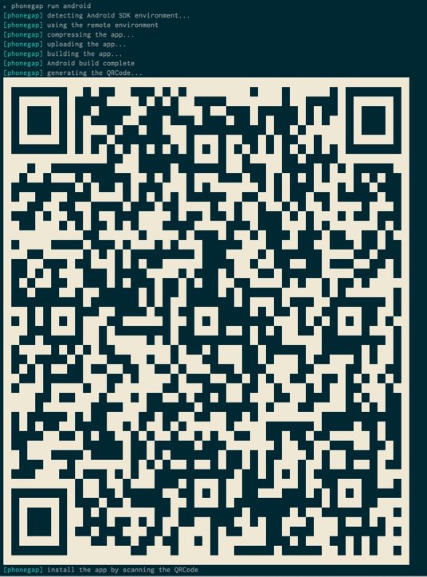

I know the font is small, but you'll notice that right away it attempts detect an Android SDK. It won't detect anything at the moment, so it falls back to using PhoneGap Build. It uploads the app, builds it and generates a QR code that I can now scan to install the .apk installer. When I scan the QR Code on my Android device and attempt to open the URL embedded in it, I will be prompted to log in using my PhoneGap Build account:

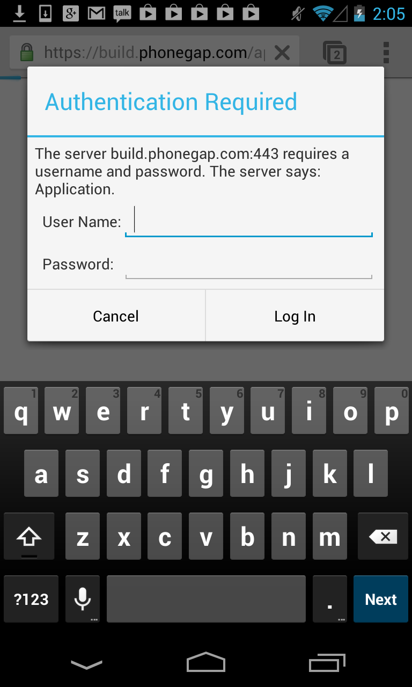

Once I authenticate with PhoneGap Build, the .apk (Android installer) will be downloaded to my device and I can install it. Running it won't show us much, but here's what it looks like:

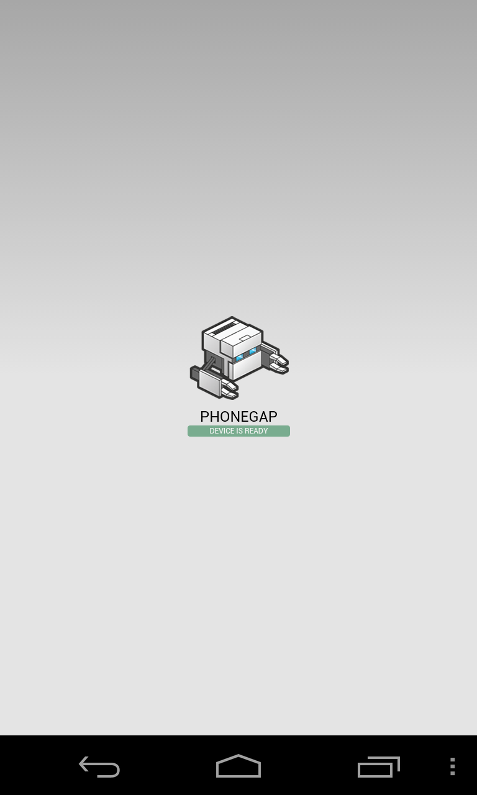

Remember the display text argument we provided ("HaiMobile")? You can see it here as we view our running apps on the device:

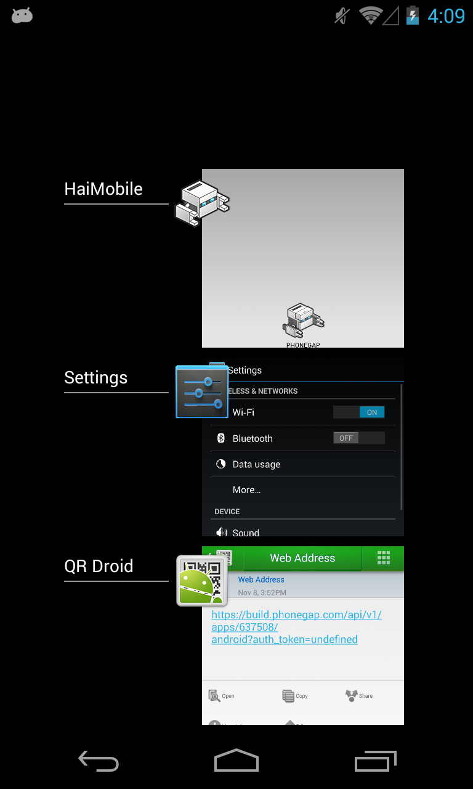

###Getting a Local Build
In order to build an app for Android *locally*, I need to install the Android SDK, and configure a few things. I highly recommend reading through the PhoneGap documentation's "[Android Platform Guide](http://docs.phonegap.com/en/3.1.0/guide_platforms_android_index.md.html#Android%20Platform%20Guide)" section - as it will help get you up and running. *Jim runs off to install the Android SDK...*

Now that I've installed the Android SDK, I can do the following (in my project directory):

	cordova platforms add android
	
Remember how I said the PhoneGap CLI wraps the Cordova CLI? This is why the above command works, since the Cordova CLI was installed when I installed the Phonegap CLI.

> It's possible you'll run into issues with the above statement. You will need to have [ant](http://ant.apache.org/manual/install.html) installed - and if you're on OS X Mavericks, you can `brew install ant` using [homebrew](http://brew.sh/). You will get an error if you've used a space in the display text argument passed to `phonegap create` (hence, why we used "HaiMobile" instead of "Hai Mobile").

Now that we have the android platform added to our project, we can build locally:

	phonegap build android
	
We could also have used `phonegap local build android`, but the above command will detect our Android SDK now and use it instead of falling back to the cloud-based PhoneGap Build tools. 

So - where is our .apk file (the Android installer)? You'd find it under the `my-mobile-app/platforms/android/bin` folder. However, the PhoneGap CLI gives us a better option that having to manually copy that file to our device:

	phonegap run android
	
Here's a quick screen capture of running this command (using [droid@screen](http://droid-at-screen.ribomation.com/) to mirror my Nexus Phone):

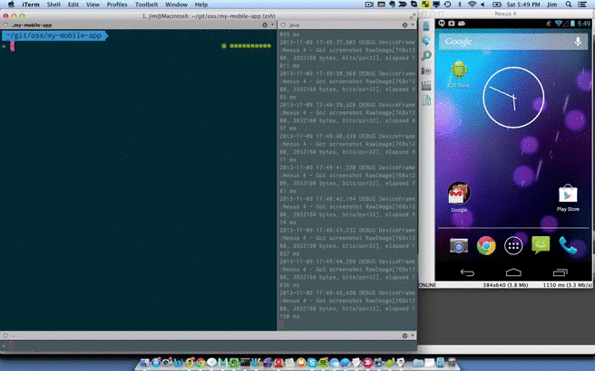
	
By the way - the command above both builds *and* installs the .apk to a connected device. You can optionally use `phonegap install android` if all you need to do is install the app.

###Writing an App
OK, great - we've managed to get both remote and local builds working, but no one wants to stare at a PhoneGap icon with "Device Ready" pulsing below it. All we need to do is open an IDE and edit the contents of the `www/` directory in the project - since it contains the HTML, JavaScript, CSS, images and other content that will run inside the native application container on the device.  I'm a big fan of [WebStorm](), so let's use it open the project and see what our directory structure looks like:

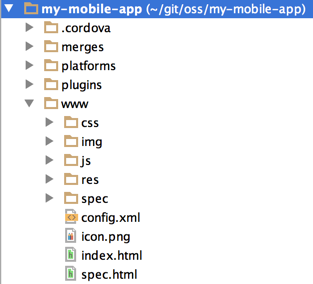

My good friend [Burke Holland]() and I recently worked on a fun sample idea together: "Chuck Facts" (a Chuck Norris Joke app). Let's see what would be involved in building that application with PhoneGap.

####Step 1.) Updating Our Index.html
Our `www/index.html` file is currently full of stock boilerplate. I'm going to steal the [index.html](https://github.com/Icenium/chuck-facts/blob/master/the-facts/index.html) from the project Burke and I worked on and use it instead (with a few slight adjustments) - here's what we end up with:

	<!DOCTYPE html>
	<html>
	<head>
	    <title>Chuck Facts</title>
	    <meta charset="UTF-8" />
	    <link href="kendo/styles/kendo.dataviz.mobile.min.css" rel="stylesheet" />
	    <link href="kendo/styles/kendo.dataviz.flat.min.css" rel="stylesheet" />
	    <link href="css/main.css" rel="stylesheet" />
	    
	    
	    
	    
	</head>
	<body>
	
	    <!-- the funny jokes -->
	    

	        <!-- this header overrides the header defined in the layout -->
	        

	            

	                
	                <button data-role="button" data-align="right" data-icon="refresh" data-bind="click: refresh"></button>
	            

	        

	        <h3 data-bind="html: joke"></h3>
	    

	
	    <!-- the nerdy jokes -->
	    

	        <!-- this header overrides the header defined in the layout -->
	        

	            

	                
	                <button data-role="button" data-align="right" data-icon="refresh" data-bind="click: refresh"></button>
	            

	        

	        <h3 data-bind="html: joke"></h3>
	    

	
	    <!-- the dashboard -->
	    

	        

	    

	
	    <!-- the common layout for all views -->
	    

	        <!-- the footer widget pins content to the top of the screen -->
	        

	            <!-- the navbar widget creates a title bar which can also hold buttons -->
	            

	                <!-- the view-title widget displays the value of whatever is in the 'data-title' attribute on the current view -->
	                
	            

	        

	        <!-- the footer widget pins the content to the bottom of the screen -->
	        

	            <!-- the tabstrip widget creates the familiar mobile tabstrip -->
	            

	                <!-- each tabstrip button is an anchor. It's href attribute points
	                     to the id of the view that should be shown when that items is tapped. -->
	                <a href="funny" data-icon="funny">Funny</a>
	                <a href="nerdy" data-icon="nerdy">Nerdy</a>
	                <a href="dashboard" data-icon="dashboard">Dashboard</a>
	            

	        

	    

	
	    

	        

	            <h2>Offline</h2>
	        

	        <h3>Chuck Norris doesn't need an internet connection, but you do.  Make sure you are online and then try again.</h3>
	    

	</body>
	</html>

We're not going to go over the above markup line-by-line, but let's at least cover some relevant details:

* We're using [Kendo UI Mobile](http://www.kendoui.com/mobile.aspx)
* Our app has 4 possible "screens" - each indicated by a `div` with a [`data-role="view"`](http://docs.kendoui.com/getting-started/mobile/view).
* We have CSS and JavaScript assets we need to add to our project.

####Step 2.) Adding JavaScript and CSS Assets
Based on what we can see above, we need to add our Kendo UI Mobile CSS and JavaScript, as well as a `www/js/app.js` and `www/css/main.css`. Our directory structure looks like this now:

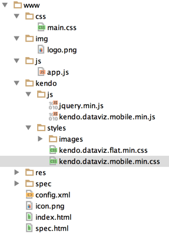

It still has a bit of the boilerplate which our `phonegap create` scaffold created for us - but that's OK. We'll leave that alone since we just want to get a basic app running.

####Step 3.) Updating app.js
Our `www/js/app.js` file now looks as follows (this is also taken directly from the [project Burke and I worked on](https://github.com/Icenium/chuck-facts/blob/master/the-facts/scripts/app.js)):

	(function (g) {
	    var api = "http://facts.azurewebsites.net/api/";
	
	    // create a variable on the window to hold all of our custom code
	    g.app = {};
	
	    // get a random joke by category
	    var getRandomJoke = function (category, viewModel) {
	        g.app.application.showLoading();
	        $.get(api + "jokes?type=" + category, function (data) {
	            // update the view model
	            viewModel.set("joke", data.JokeText);
	            g.app.application.hideLoading();
	        });
	    };
	
	    // create a base class for the nerdy and funny view
	    var jokeModel = kendo.Class.extend({
	        // the init method is the constructor and is called when the object
	        // is created using the 'new' keyword
	        init: function (category) {
	            // store a reference to the base class object
	            var that = this;
	
	            // attach a category field to this instance and set it's
	            // value to the parameter passed into the init method
	            that.category = category;
	
	            // create a view model
	            that.viewModel = kendo.observable({
	                joke: null,
	                refresh: function () {
	                    getRandomJoke(that.category, this);
	                }
	            });
	
	            // expose a random joke method
	            this.getRandomJoke = function () {
	                getRandomJoke(that.category, that.viewModel);
	            }
	        }
	    });
	
	    // create a new funny model from the base jokeModel class
	    g.app.funny = new jokeModel("funny");
	
	    // create a new nerdy model from the base jokeModel class
	    g.app.nerdy = new jokeModel("nerdy");
	
	    g.app.dashboard = (function () {
	
	        var init = function () {
	            $("#chart").kendoChart({
	                theme: "flat",
	                title: {
	                    text: "Chuck Norris Fact Categories"
	                },
	                dataSource: {
	                    transport: {
	                        read: api + "dashboard"
	                    }
	                },
	                legend: {
	                    position: "top"
	                },
	                chartArea: {
	                    background: ""
	                },
	                seriesDefaults: {
	                    labels: {
	                        visible: false
	                    }
	                },
	                series: [{
	                    type: "pie",
	                    field: "value",
	                    categoryField: "category",
	                    startAngle: 150
	                }]
	            });
	        };
	
	        return {
	            init: init
	        };
	
	    }());
	
	    var init = function () {
	        var os = kendo.support.mobileOS;
	        var statusBarStyle = os.ios && os.flatVersion >= 700 ? "black-translucent" : "black";
	
	        // create a new kendo ui mobile app using the whole page
	        new kendo.mobile.Application(document.body, {
	            transition: "slide", init: function () {
	                g.app.application = this;
	                getRandomJoke("funny", g.app.funny.viewModel);
	            },
	            statusBarStyle: statusBarStyle,
	            skin: "flat"
	        });
	
	        navigator.splashscreen.hide();
	    };
	
	
	    document.addEventListener("deviceready", init, false);
	
	    document.addEventListener("offline", function () {
	        g.app.application.navigate("#offline");
	    });
	
	    document.addEventListener("online", function () {
	        if (g.app.application) {
	            g.app.application.navigate("#:back");
	        }
	    });
	
	}(window));

So what's going on here?

* We have a public API endpoint we're using to get Chuck Norris jokes.
* We're creating view models for each screen ("funny", "nerdy" and "dashboard")
* We create an `init` function that's invoked when the [`deviceready`](http://docs.phonegap.com/en/3.1.0/cordova_events_events.md.html#deviceready) event occurs. The `deviceready` event is emitted when Phonegap/Cordova is fully loaded and it's APIs are ready to use. It's pretty common to hook your app's initialization into this event.
* We warn the user if the device is offline.

Feel free to source dive that more in depth if you like - we're going to focus on getting the app running on a device.

####Step 4.)Adding Images
I'm adding a small icon to be used for the app when installed, as well as a splash screen that will be displayed when the app is launching. Since this is a demo, I'm not terribly concerned at the moment with supporting various resolutions - but that's something you should be aware of, if you want your icons and splash screens to look correct on various devices. I've added my images to the `www/res/icon/android` and `www/res/screen/android` directories, and then updated my `www/config.xml` to utilize them.

>##Wait, what's the config.xml file?
From the [documentation](http://docs.phonegap.com/en/3.1.0/config_ref_index.md.html#The%20config.xml%20File): *"Many aspects of an app's behavior can be controlled with a global configuration file, config.xml, that is placed in the top-level web asset directory along with the app's home page. This platform-agnostic XML file is formatted based on the W3C's Packaged Web Apps (Widgets) specification, and extended to specify core Cordova API features, plugins, and platform-specific settings."*

Here's our mostly-boilerplate config.xml (notice it still contains the stock values for elements like `description` and `author` – these are obviously things you would want to customize):

	<?xml version='1.0' encoding='utf-8'?>
	<widget id="com.ifandelse.mymobileapp" version="1.0.0" xmlns="http://www.w3.org/ns/widgets" xmlns:gap="http://phonegap.com/ns/1.0">
	    <name>HaiMobile</name>
	    <description>
	        Hello World sample application that responds to the deviceready event.
	    </description>
	    <author email="support@phonegap.com" href="http://phonegap.com">
	        PhoneGap Team
	    </author>
	    <feature name="http://api.phonegap.com/1.0/device" />
	    <preference name="permissions" value="none" />
	    <preference name="orientation" value="default" />
	    <preference name="target-device" value="universal" />
	    <preference name="fullscreen" value="true" />
	    <preference name="webviewbounce" value="true" />
	    <preference name="prerendered-icon" value="true" />
	    <preference name="stay-in-webview" value="false" />
	    <preference name="ios-statusbarstyle" value="black-opaque" />
	    <preference name="detect-data-types" value="true" />
	    <preference name="exit-on-suspend" value="false" />
	    <preference name="show-splash-screen-spinner" value="true" />
	    <preference name="auto-hide-splash-screen" value="true" />
	    <preference name="disable-cursor" value="false" />
	    <preference name="android-minSdkVersion" value="7" />
	    <preference name="android-installLocation" value="auto" />
	    <icon src="icon.png" />
	    <icon gap:density="ldpi" gap:platform="android" src="res/icon/android/chuck.png" />
	    <icon gap:density="mdpi" gap:platform="android" src="res/icon/android/chuck.png" />
	    <icon gap:density="hdpi" gap:platform="android" src="res/icon/android/chuck.png" />
	    <icon gap:density="xhdpi" gap:platform="android" src="res/icon/android/chuck.png" />
	    <icon gap:platform="blackberry" src="res/icon/blackberry/icon-80.png" />
	    <icon gap:platform="blackberry" gap:state="hover" src="res/icon/blackberry/icon-80.png" />
	    <icon gap:platform="ios" height="57" src="res/icon/ios/icon-57.png" width="57" />
	    <icon gap:platform="ios" height="72" src="res/icon/ios/icon-72.png" width="72" />
	    <icon gap:platform="ios" height="114" src="res/icon/ios/icon-57-2x.png" width="114" />
	    <icon gap:platform="ios" height="144" src="res/icon/ios/icon-72-2x.png" width="144" />
	    <icon gap:platform="webos" src="res/icon/webos/icon-64.png" />
	    <icon gap:platform="winphone" src="res/icon/windows-phone/icon-48.png" />
	    <icon gap:platform="winphone" gap:role="background" src="res/icon/windows-phone/icon-173.png" />
	    <gap:splash gap:density="ldpi" gap:platform="android"  src="res/screen/android/chucksplash.png" />
	    <gap:splash gap:density="mdpi" gap:platform="android"  src="res/screen/android/chucksplash.png" />
	    <gap:splash gap:density="hdpi" gap:platform="android"  src="res/screen/android/chucksplash.png" />
	    <gap:splash gap:density="xhdpi" gap:platform="android" src="res/screen/android/chucksplash.png" />
	    <gap:splash gap:platform="blackberry" src="res/screen/blackberry/screen-225.png" />
	    <gap:splash gap:platform="ios" height="480" src="res/screen/ios/screen-iphone-portrait.png" width="320" />
	    <gap:splash gap:platform="ios" height="960" src="res/screen/ios/screen-iphone-portrait-2x.png" width="640" />
	    <gap:splash gap:platform="ios" height="1024" src="res/screen/ios/screen-ipad-portrait.png" width="768" />
	    <gap:splash gap:platform="ios" height="768" src="res/screen/ios/screen-ipad-landscape.png" width="1024" />
	    <gap:splash gap:platform="winphone" src="res/screen/windows-phone/screen-portrait.jpg" />
	    <access origin="http://facts.azurewebsites.net" />
	    <content src="index.html" />
	</widget>

You'll notice something *very* important in this file as well - the `access` element towards the end, with an origin of `http://facts.azurewebsites.net`. This means that we've [whitelisted](http://docs.phonegap.com/en/3.1.0/guide_appdev_whitelist_index.md.html#Whitelist%20Guide) this origin so our app can access it. Setting the `access` origin is essential if you want your app to be able to reach out to external services. (By default, the origin is set to `127.0.0.1*`, which would have prevented our app from communicating to the Azure service.)

####Step 5.) Run the App
While it's *far* from perfect, we now have enough to build and run the app on an Android device. I have the option to run a local build, or build remotely via PhoneGap Build and download the .apk (installer). Scanning QR codes in a terminal never gets old, so let's build remotely:

	phonegap remote run android
	
When the build completes, I can scan the QR code that appears in the console to install the app. Here's a short video of this process:

<iframe width="640" height="360" src="//www.youtube.com/embed/EFP5JJswynk?feature=player_detailpage" frameborder="0" allowfullscreen></iframe>

Success! There are several things we'd want to address before this app could be considered app-store-worthy – splash/icon images covering different resolutions, fully customizing descriptive data about the app in our `config.xml`, signing our app for distribution and more. However, in just a few steps we went from installing PhoneGap from npm to building and running an actual app on a device. I *love* this stuff!

###Just the Facts
To use PhoneGap Build, I obviously needed an account. PhoneGap Build has both free and paid subscriptions. As of this moment, the available PhoneGap Build plans are as follows:

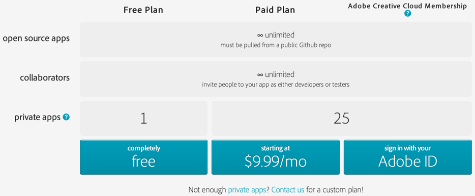

Developing "in the open" is free. If you (or your company) aren't comfortable with your project being in full public view, you can move to a paid plan to support private apps.

##Telerik Icenium
[Icenium](http://www.icenium.com/) - like PhoneGap Build - provides cloud-based build services (targeting Android and iOS, and Windows Phone 8 *soon*). In addition, Icenium provides a browser-based IDE ([Mist](http://www.icenium.com/product/mist)), a Windows Client ([Graphite](http://www.icenium.com/product/graphite)) and a [Visual Studio Extension](http://www.icenium.com/product/visual-studio-extension) (for "Icenium Ultimate" subscribers) for writing hybrid mobile apps. A command-line-interface is also on the road map to support users who prefer to stick with their own local IDE/development workflow. Icenium also provides direct-to-app-store publishing capabilities as well as some utilities to help manage developer certificates/provisioning profiles for signing your apps.

>###Full Disclosure
I work for Telerik, advocating for web and hybrid mobile products. However - I'm writing this post on my own time, so the opinions reflected here are *mine*, not those of Telerik. I find the Cordova ecosystem both fascinating and compelling, and really believe that what Adobe and Telerik have accomplished in this space is nothing short of amazing.

Icenium has gone all-in on the "cloud". There are no local SDK installs - when you build, you're utilizing Telerik's build platform. This means Windows-based developers can easily write iOS apps without needing to switch to a Mac, for example. Emulating Cordova apps in the browser is really simple when using Mist - and you get all the power of the developer tools available in your browser. Both Graphite & the Icenium Extension for Visual Studio utilize a WebKit-based simulator - providing solid debugging tools along with emulation utilities for location and connection type, etc. We'll take a look at both in a moment.

####Step 1.) Getting An Account
If you're trying out Icenium for the first time, you can start a free 30-day trial by going to [https://app.icenium.com/Mist](https://app.icenium.com/Mist). You can pick from a number of login options:

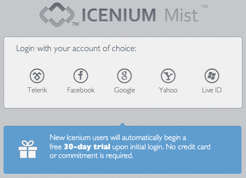

Once you start your trial, you'll be greeted with the Mist Dashboard:

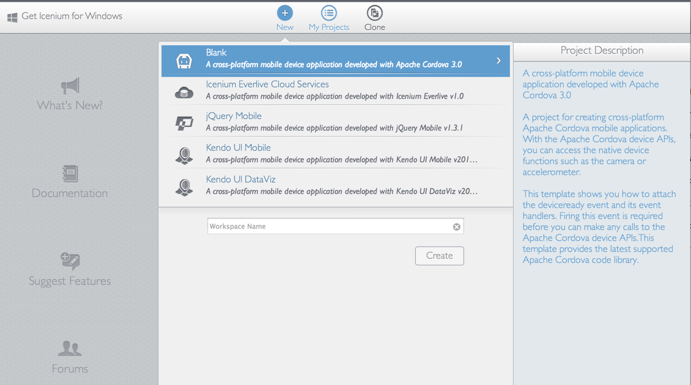

You'll notice that Icenium provides a few project templates for you:

* Blank (a plain Cordova app, effectively similar to the stock app created with `phonegap create`)
* Icenium Everlive Cloud Services - provides a sample app for using Icenium with [Everlive](http://telerik.com/everlive) - a Backend-as-a-Service platform also built by Telerik.
* jQuery Mobile
* Kendo UI Mobile
* Kendo UI DataViz (useful for apps that need to take advantage of the reporting/visualization features in DataViz)

Our goal is to get the same app we just ran via PhoneGap/PhoneGap Build running here in Icenium, so let's opt for the "Blank" project type and build from there.

> It's worth nothing that Icenium supports cloning from any accessible git provider (including private repos), so I could clone this project from an existing repo if I wanted to, but that would spoil the fun!

####Step 2.) Updating our index.html
As we look at the project structure in Mist, it's easy to see that Icenium has effectively presented us with the `www/` folder of a PhoneGap/Cordova project, abstracting the rest of the concerns behind Telerik's cloud build services:

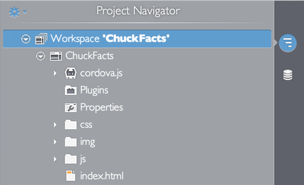

However, Icenium still allows you to make changes to the `config.xml` (and more) by right-clicking the project itself and choosing "Edit Configuration":

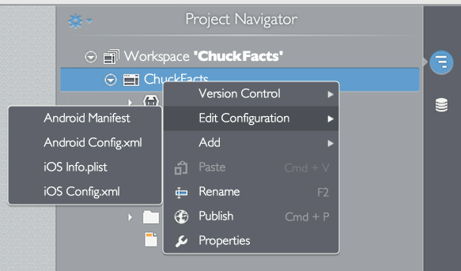

Let's open up our index.html in Mist, and copy in the markup we used for our PhoneGap version (except we're going to change our "phonegap.js" reference to "cordova.js"):

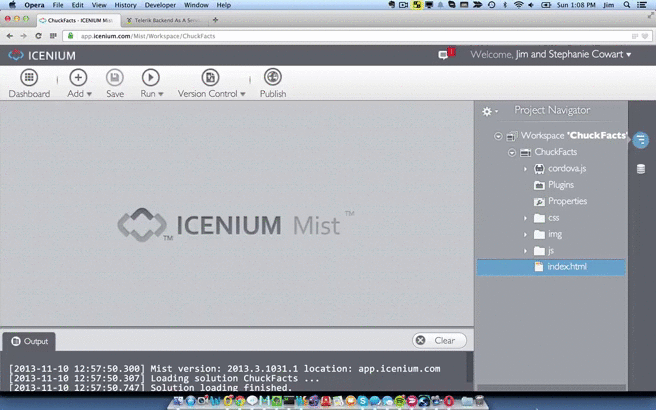

That was easy. However, we have CSS and JavaScript assets to add just like we did with our PhoneGap version.

####Step 3.) Adding our app.js
In our `js/` folder, we need to delete our index.js file and then add our app.js:

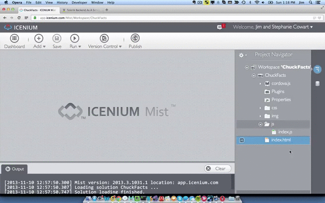

####Step 4.) Adding our main.css
In our `css/` folder, we can re-name `index.css` to `main.css` and paste in our styles:

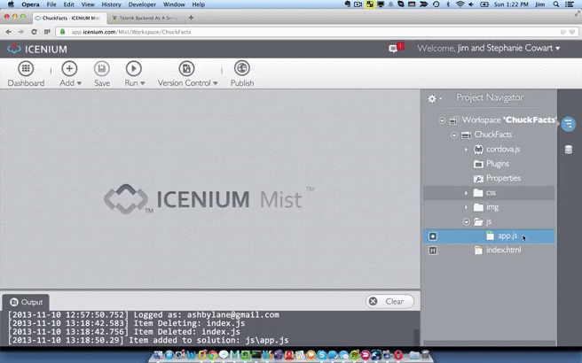

####Step 5.) Adding the Kendo UI Assets
So - we've seen deleting, adding and re-naming files in Mist (all things you'd expect from any IDE), but we can also upload local files to be included in our project. I have a zip archive of the Kendo UI Mobile assets that I can upload, and Mist will take care of extracting the contents to my project structure:

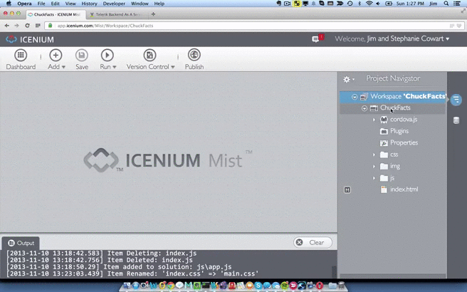

####Step 6.) Updating our Icon and Splash Screen
Icenium provides a UI to help us assign icons and splash screens. In the "Project Navigator", you can double-click "Properties", and then select "Icons" under "iOS". Simply click the icon you want to update (you'll be prompted to upload a file, etc.). I know Apple would *never* let me get a way with this, but since we're just writing a demo, I've updated our iOS 7 icons with an epic Chuck Norris icon:

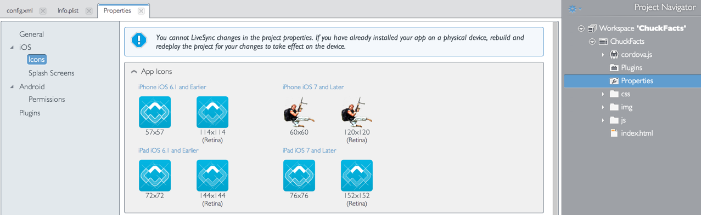

Next, we'll select "Splash Screens" under "iOS". I'll go ahead and update our iPhone splash screens to display the fake incoming call from Chuck Norris (you know - where your options are to answer, or, um, *answer*... since no one ignores Chuck Norris's phone calls):

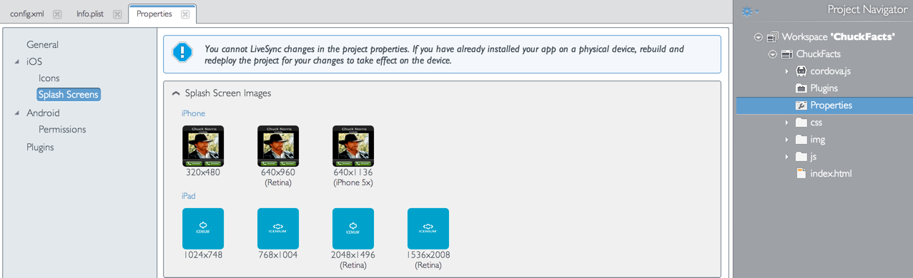

####Step 7.) Run the App
Icenium Mist has a nice simulator option - but we have one glaring problem that will prevent us from using it (you might have already guessed what it is): CORS restrictions will bite us when our app attempts to make a call to http://facts.azurewebsites.net (since the calls are originating from http://app.icenium.com and our Azure services aren't configured for `Access-Control-Allow-Origin` headers). This will be a common situation for many PhoneGap/Cordova emulation environments. Let's work around this temporarily in Mist by hard-coding our external request:

	// get a random joke by category
    var getRandomJoke = function (category, viewModel) {
        g.app.application.showLoading();
        viewModel.set("joke", "Chuck Norris doesn't need to worry about CORS, but we do...");
        g.app.application.hideLoading();
        //$.get(api + "jokes?type=" + category, function (data) {
        //    // update the view model
        //    viewModel.set("joke", data.JokeText);
        //    g.app.application.hideLoading();
        //});
    };

Nice - so let's take a quick peek at running the simulator in Chrome:

You notice that Mist alerts us to a possible CORS error when we attempt to load the pie chart (dashboard) view:

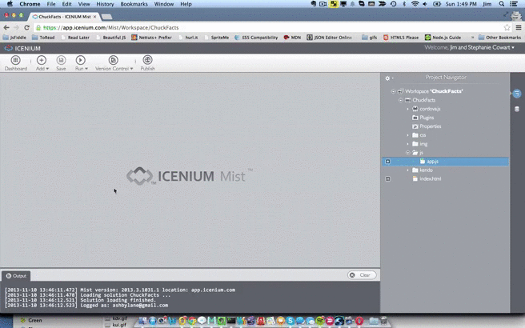

This alert tells us that we can use Icenium Graphite (Icenium's Windows client IDE) as an alternative - since it wouldn't be subjected to the same CORS restrictions, OR we can test on a device. Before we move on to testing on a device, let's look at the connection type emulation and how we can open our developer tools to debug the app as well:

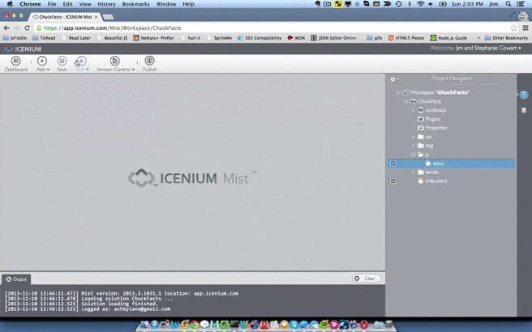

In the above gif-screenshot, you can see that when we change our connection type to "None", our app's "offline warning" view is shown. I also quickly show that the Chrome Developer tools - like inspecting the DOM, viewing/debugging JavaScript (and more!) are available to help you debug and profile your application while you're using the simulator.

But really - *there is no substitute for running your app on a device*. Let's remove that hard-coded JavaScript from earlier and deploy this app to an actual device. We currently have two options, deploy to Android or iOS...

####Step 8.) Deploying to iOS
One of the things I love about Icenium is the ability to deploy to an iOS device *without a provisioning profile*. If you've ever done any iOS development, you know that even ad hoc deployments to a device for testing require a developer certificate, app ID & device IDs to all be tied together with a [provisioning profile](http://docs.icenium.com/code-signing-your-app/configuring-code-signing-for-ios-apps/add-provisioning-profile). Icenium uses an app called [Icenium Ion](http://www.icenium.com/product/ion) - which runs on your iOS device - to quickly deploy a hybrid app for testing. Since I have Ion installed on my device, all I need to do is build my app for iOS and scan the QR code with a QR code reader and Ion will pull the app down:

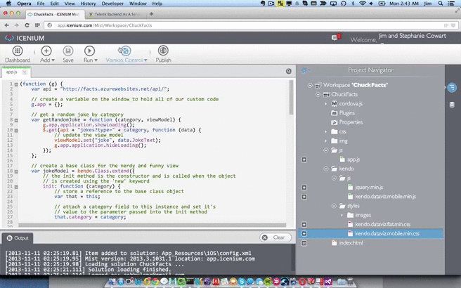

> Important Note: Icenium Ion acts as a "container app". Using Ion for a "provision-less" deployment works in the above scenario *because our app isn't using any custom Cordova/PhoneGap plugins. If you're using plugins, you have to deploy to your iOS device using a provisioning profile.

Icenium Ion comes in handy when you want to quickly get your app onto a device - but you miss out on icon and splash screen changes. Let's deploy to a device using an Ad Hoc provisioning profile to prove that our icon and splash screens do, in fact, show Chuck Norris:

<iframe width="640" height="360" src="//www.youtube.com/embed/5Kx9kPPfqlA?feature=player_detailpage" frameborder="0" allowfullscreen></iframe>

###Just the Facts (again)
Icenium is subscription-based and starts at $16 per month. There are three different tiers – here's a breakdown of what comes with each:

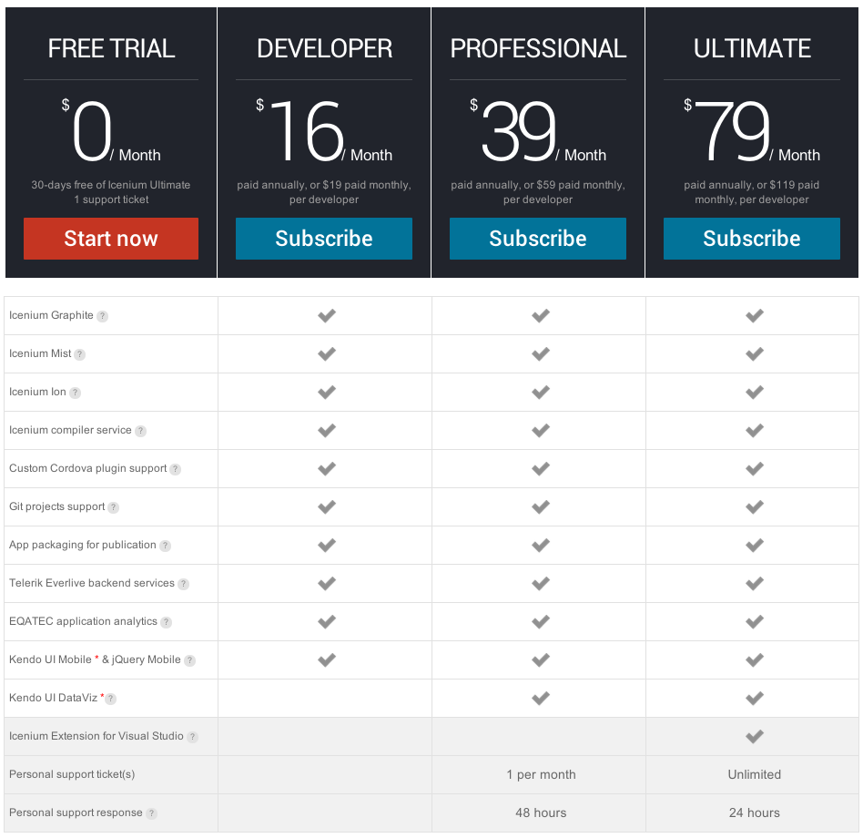 

#Which One Should I Use?
That's the million dollar question, right?

> "It depends." –– Every Smart Developer

Both platforms are powerful tools, with some overlap (especially around building in the cloud), but there are enough differences overall that those may help guide you in deciding between the two. Icenium supports Android and iOS (and should land Windows Phone 8 support soon). If you need to target mobile platforms above and beyond that, then looking at PhoneGap Build makes a lot of sense, since it supports a long list of platforms. If you have a moderate-to-complex continuous integration & build tool chain, and want to integrate building hybrid mobile apps into it, then PhoneGap Build makes a lot of sense, given the hooks provided by the PhoneGap & Cordova CLIs.

However, if your team prefers a centralized place to help manage the headaches of things like code signing, platform-specific settings and images, provision-less device deployment, app-store-deployment and more - then Icenium is a compelling option. Telerik also has several other products that integrate well with Icenium such as [Everlive](http://telerik.com/everlive) (a Backend-as-a-Service), [Kendo UI Mobile](http://www.kendoui.com/) (which has impressive performance on mobile devices) and [EQATEC](http://www.telerik.com/analytics) (for app analytics). There are, of course, other options when it comes to BaaS's, UI frameworks and analytics. Mobile development today is a lot like eating at a buffet, where the buffet line is scattered throughout several rooms and floors of a large building. Knowing what kind of tools you need as well as the best tool for that concern can be terribly frustrating for any team – so there's something to be said for approaches that show how related products can interact and get you up and running more quickly with your mobile app.

Both products support utilities to help you quickly refresh your app on a device (during development and testing) – Adobe has [Hydration](https://build.phonegap.com/docs/advanced-hydration), and Telerik has [Icenium Ion](http://www.icenium.com/product/ion) and [LiveSync](http://docs.icenium.com/testing-your-app/livesync/configuring-livesync/configuring-livesync). One critical element to *any* mobile offering based on Cordova is the ability to support custom Cordova/PhoneGap plugins – both PhoneGap Build and Icenium support custom plugins.

#Try Them
It's probably obvious that the whirlwind tour we've taken during this blog post has only scratched the surface. There's *so much more* - details related to UI performance, storage, app store approval tips, how to integrate custom plugins, remote debugging on devices - the list could go on! One of the most important things you can do is evaluate – as in, *actually write a prototype app* – mobile development options* like PhoneGap Build and Icenium. While you're doing that, you can build your overall knowledge base on hybrid mobile with some of the further reading options below.

#Further Reading

* [Demystifying Apache Cordova and PhoneGap](http://www.icenium.com/blog/icenium-team-blog/2013/03/26/demystifying-apache-cordova-and-phonegap)
* [Getting Started With PhoneGap and PhoneGap Build](http://phonegap.com/blog/build/getting-started-with-phonegap-and-phonegap-build/) by [Colene Chow](https://twitter.com/colene)
* [Getting Started with Icenium](http://docs.icenium.com/getting-started/getting-started)
* [Tips for Developing Apps with PhoneGap](http://phonegap.com/blog/2013/07/25/tips-for-developing-apps-with-pg/)
* [My Development Workflow for PhoneGap iOS Apps](http://devgirl.org/2013/06/12/my-development-workflow-for-phonegap-ios-apps/) via [Holly Schinsky](https://twitter.com/devgirlFL)
* [Performance & UX Considerations For Successful PhoneGap Apps](http://www.tricedesigns.com/2013/03/11/performance-ux-considerations-for-successful-phonegap-apps/) by [Andrew Trice](https://twitter.com/andytrice)
* [Remote Debugging Android Devices with jsHybugger](http://www.icenium.com/blog/icenium-team-blog/2013/11/05/remote-debugging-android-devices-with-jshybugger)
* [Enable Remote Debugging with Safari Web Inspector in iOS 6](http://moduscreate.com/enable-remote-web-inspector-in-ios-6/)
* [http://phonegap-tips.com/](http://phonegap-tips.com/)
* [Top 10 Performance Techniques for PhoneGap Applications (video)](http://coenraets.org/blog/2013/05/top-10-performance-techniques-for-phonegap-applications/) by [Christophe Coenraets](https://twitter.com/ccoenraets)
* [5 Myths About Mobile Web Performance](http://www.sencha.com/blog/5-myths-about-mobile-web-performance/)
* [Best Of Both Worlds: Mixing HTML5 And Native Code](http://mobile.smashingmagazine.com/2013/10/17/best-of-both-worlds-mixing-html5-native-code/)
* [How to build a hybrid app that performs like native — yes, it can be done](http://venturebeat.com/2013/11/07/how-to-build-a-hybrid-app-that-performs-like-native-yes-it-can-be-done/) by [Brandon Satrom](https://twitter.com/brandonsatrom)
