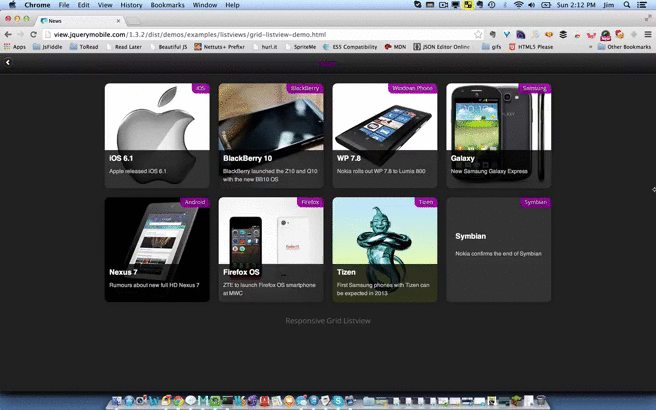
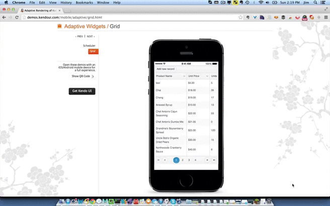
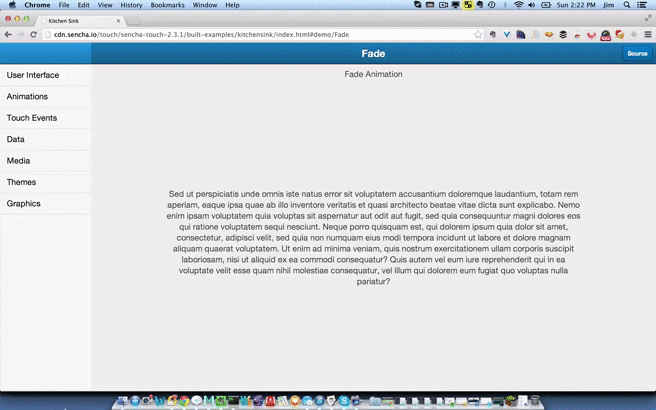
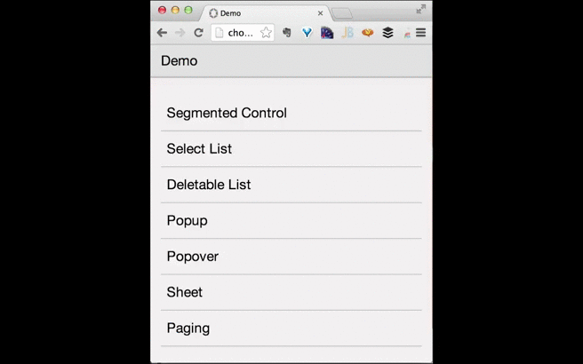

#Mobile UI Frameworks

Deciding on a cross-platform tool (CPT) when developing mobile applications is really only the first step of a larger journey. When you choose a web-based CPT (PhoneGap, for example), you're typically faced with the decision of what UI framework to choose as well. The good news is that there are number of powerful options available. We'll take a brief look at a few of these in this post. There's a wide range of what's available in a UI framework – some focus entirely on widgets (UI components), others provide light app framework functionality and still others provide a more comprehensive set of behaviors covering widgets and application framework concerns. The "right" choice for your project will depend largely on what you need, your team's background and what kind of control you want to retain over certain aspects of the application architecture.

> Really - there are SO many interesting options, it can feel overwhelming even if you're a veteran of HTML5-based mobile development. I will include a list of additional frameworks at the end in case you'd like to explore beyond the few we cover in this post.

<h2>

jQuery Mobile

</h2>

[jQuery Mobile](http://jquerymobile.com/) is arguably the most widely used mobile framework - benefiting from association with the nearly ubiquitous jQuery project. Due to it's recognition and association with jQuery-based open source development, jQuery Mobile boasts a huge number of 3rd party plugins, extensions, tools, themes and more.

###High Level Overview
Developers writing mobile and hybrid mobile apps using jQuery Mobile will encounter the following:

* Heavy use of HTML `data-*` attributes. For example, a "page" in a jQuery Mobile application is simply a DOM element with `data-role="page"` attribute/value on it. Experienced web developers will pick up these kinds of framework conventions quickly.
* jQuery Mobile provides a *light* application framework – primarily covering navigation, & transitions between views. This can be extended via plugins, or through integration with more comprehensive frameworks. If your "app framework" needs extend beyond transitions and navigations (for example, templating, two-way binding and more), jQuery Mobile *alone* may not be a good fit.
* It's designed to work within a Responsive Web Design (RWD) context - enabling developers to target a wide range of devices.
* A wide array of device and browser support as well as a helpful [theme roller](http://jquerymobile.com/themeroller/) to help with quickly customizing the otherwise "clone" look and feel.

> Despite its popularity, jQuery Mobile has been criticized for performing poorly in mobile browsers. The jQuery Mobile team continues to work to [improve the framework](http://jquerymobile.com/blog/2013/10/24/jquery-mobile-1-4-0-rc1-released/), including performance issues. If your team opts for jQuery Mobile, avoiding deeply nested DOM structures & unnecessary reflows and investigating the use of libraries like [FastClick](https://github.com/ftlabs/fastclick) can help you avoid some of the typical pitfalls that have earned jQuery Mobile the "slow" label.

###Widgets

jQuery Mobile's site currently lists 22 built-in widgets (though the number of custom/3rd party widgets is much higher). Among them are header, footer, navbar, listview, slider popup and more (all the basics you would expect). Creating customized widgets is likely a moderate amount of effort for most developers. jQuery Mobile's good documentation and examples will be helpful for any team. You can view a list of demos [here](http://view.jquerymobile.com/1.3.2/dist/demos/examples/).

The screen capture below demonstrates one of jQuery Mobile's widgets: the responsive grid listview:

 

###Licensing
jQuery mobile is free and open source (MIT licensed).

<h2>

Kendo UI Mobile

</h2>

Telerik's [Kendo UI Mobile](http://www.kendoui.com/) framework has emerged as a powerful and performance-minded framework for mobile web and hybrid mobile applications. Kendo UI Mobile provides both UI widgets and app framework functionality. Kendo UI Mobile is part of a larger Kendo UI framework that can target both desktop and mobile devices. In addition, Kendo UI Dataviz is arguably one of the best data visualization libraries available for both desktop and mobile web clients.

###High Level Overview
Developers writing mobile and hybrid mobile apps will encounter the following:

* Theming that matches the 'native' look and feel of iOS, Android, Blackberry and Windows Phone 8, as well as a "flat" theme that looks nice across multiple devices.
* Similar to jQuery Mobile, Kendo UI Mobile makes use of HTML5 `data-*` attributes. For example, a "view" in a Kendo UI Mobile application is a DOM element with `data-role="view"`. This naturally extends to Kendo UI Mobile's widgets as well, since (for example) an unordered list element can be made into a "listview" element simply by adding `data-role="listview"` to the element.
* Two-way binding, with a declarative syntax. Kendo UI Mobile provides some fairly sophisticated application framework features, with MVVM (model-view-viewmodel) infrastructure included. Application state is typically maintained in 'view models', which are bound to views (DOM templates). As data in views change, the view models are automatically updated (and vice versa). By "declarative" we mean that the metadata necessary to enable two-way binding can be provided in the actual markup. For example, to bind the text content of a `span` to the `firstName` value of a view model, developers simply include this in the markup: ``. Frameworks supporting two-way binding often help eliminate the same tired boilerplate code necessary in traversing DOM structures to retrieve state (user input, etc.). This can be a big producitivy boost for your team.
* Also included in the application framework features: view transitions, navigation & layout templates (which can be highly customized) as well as "DataSources" - an abstraction over retrieving data from multiple kinds of sources (for example, simple HTTP services, local data or even some Back-end-as-a-Service offerings). The Kendo UI team has gone quite a ways further than primiarly UI/widget focused frameworks like jQuery Mobile in providing more substantial application architectural help.

###Widgets
Kendo UI Mobile's site lists 13 built-in widgets, ranging from ListView, ModalView, and TabStrip to Navbar (including support for header & footer), Drawer and Scroller (and more). Kendo UI Mobile supports creating custom widgets as well. 

The screen capture below demonstrates a couple of Kendo UI Mobile's adaptive widgets: the Grid and Scheduler. You can view additional Kendo UI Mobile demos [here](http://demos.kendoui.com/mobile/overview/index.html).

###Licensing
Kendo UI mobile is a paid framework which starts at $199 (includes support for 1 year). 

<h2>

Sencha Touch

</h2>

Sencha will be a recognizable name to many web & mobile developers - likely due to their [response](http://www.sencha.com/blog/the-making-of-fastbook-an-html5-love-story/) to Mark Zuckerberg's [assertion](http://techcrunch.com/2012/09/11/mark-zuckerberg-our-biggest-mistake-with-mobile-was-betting-too-much-on-html5/) that "HTML5 Wasn't Ready". Sencha went on to prove that HTML5 is, indeed, ready for many complex use cases in mobile applications. [Sencha Touch](http://www.sencha.com/products/touch/) - Sencha's mobile focused HTML5 development platform – goes much further than providing only widget-focused features.

###High Level Overview
Sencha recently updated Sencha Touch so that their device APIs fully support Apache Cordova (i.e. - PhoneGap). Similar to Kendo UI Mobile, Sencha Touch makes use of HTML5 and CSS3 (taking advantage of hardware acceleration where possible) to create web-based UIs for mobile apps that aim to rival native UI performance. Developers building projects with Sencha Touch can expect the following:

* Sencha Touch leans more heavily towards "full app framework" than many other popular options. It provides an MVC style architecture, complete with storage, device profile and top-level application abstractions.
* Sencha Touch ships with 50 built-in components (and developers can create their own as well).
* It's my understanding that Touch shares some common code with ExtJS (and common conceptual paradigms), so developers familiar with ExtJS will pick things up quickly. I would also argue that developers used to frameworks like Backbone.js will also pick up the concepts more readily than developers used to UI frameworks that focus on declarative bindings in markup.
* Sencha Touch provides its own abstractions for things like history management and XHR - which is in line with expectations of any framework seeking to be a more "one stop/full-stack" option. 

###Widgets
Components are a key part of Sencha Touch's architecture. Among the 50 built-in components are ones such as Carousel, Slider, DataView, List, DatePicker and more. In other words - like the frameworks we've looked at so far, the essential things you'd expect plus a bit more. The screen capture below is showing some of the animation demos in the ["Kitchen Sink"](http://dev.sencha.com/deploy/touch/examples/production/kitchensink/) demo application, which highlights *many* features available in Touch:

###Licensing
Sencha Touch has a wide array of licensing options (which can be seen [here](http://www.sencha.com/products/touch/license/)). It's free for commerical use (and a GPLv3 option is also available). Sencha offers paid support options for Sencha Touch, starting at $1395 for a 5-developer package.

<h2>

Chocolate Chip UI

</h2>

Chocolate Chip UI's beta debuted on github roughly 3 years ago. Currently at version 3.0.6, the project has been gaining recognition as a powerful and performance-minded option for both mobile web and hybrid mobile applications targeting iOS, Android and Windows Phone 8. Chocolate Chip UI's site lists 12 widgets, but simply skimming the documentation will reveal many more. Chocolate Chip UI provides a substantial amount of UI/widget focused features, but also ventures somewhat into "application framework" territory by providing a number of utility methods & view transition features – though it stops short of client-side routing.

###High Level Overview
Developers using Chocolate Chip UI will encounter the following:

* Chocolate Chip UI makes use of [semantic HTML5 elements](http://chocolatechip-ui.com/documentation) to drive its widgets. Your team may find overtime that this aids markup readability.
* Chocolate Chip UI encourages the use of their own JavaScript library (ChocolateChip.js) in lieu of jQuery. They maintain that it was created specifically for mobile use and that it is both faster and smaller. It *is* possible to use jQuery 2.0.3 on Chocolate Chip UI version 3.0.3 and newer. This may prove useful if your team has jQuery plugins which are essential to the project.
* Chocolate Chip UI provides API hooks to create your own widgets which follow the same paradigm as creating jQuery plugins. This will aid your team's transition from jQuery to ChocolateChip.js.
* Chocolate Chip UI uses OS-specific theming, allowing you to target a specific mobile platform (currently iOS, Android and Windows Phone 8) simply by sourcing the appropriate CSS file.
* Chocolate Chip UI provides layout behaviors to help organize your DOM structure, as well as a number of ulitily methods inlcuding script loading, type testing, string utilities, AJAX communications and more.

###Widgets
As mentioned above, Chocolate Chip UI's home page lists 12 widgets – among them things like Popup, Paging, Range, Switch and multiple types of Lists. However, as you review the documentation, you'll notice mention of additional widgets such as slide out menus, masks (semi-transparent overlays), split layouts (for tablets) and more. You can see a few of these in the screen capture below (specifically, range/slider and pop-over):

###Licensing
Chocolate Chip UI can be licensed either under BSD or commercially. For commercial terms, you need to [contact Sourcebits](http://www.sourcebits.com/#!/contact) to get a quote.

##Further Resources
Markus Falk has a fantastic [mobile frameworks comparison tool](http://www.markus-falk.com/mobile-frameworks-comparison-chart/) which you may find quite useful in evaluating which options will work for your team.

This post can't possibly cover all the UI framework options available - and choosing which ones to write about was extremely difficult, given the amazing number of good choices out there. I'd like to list a few more here to give you the option of further exploring which UI framework(s) may work best for you. Bear in mind that these are *web-based* UI frameworks for mobile web or hybrid mobile solutions that make use of web-based assets (like PhoneGap):

* [PhoneJS](http://phonejs.devexpress.com/)
* [EnyoJS](http://enyojs.com/)
* [Wijmo](http://wijmo.com/)
* [iUI](http://www.iui-js.org/)
* [Twitter Bootstrap](http://getbootstrap.com/)
* [The-M-Project](http://the-m-project.net/en/)
* [Jo](http://joapp.com/)
* [EmbedJS](http://uxebu.github.io/embedjs/)
* [Junior](http://justspamjustin.github.io/junior/#home)
* [moobile](http://moobilejs.com/)

Have you used any of these options? If so, we'd love to hear about your experience. Feel like one is missing? Let us know! We'd love to hear what you've been using.

