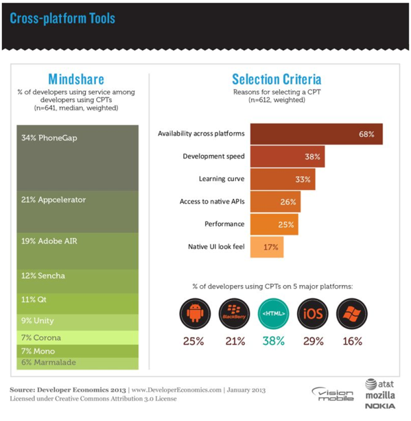

#Pros and Cons of the Top 5 Cross-Platform Tools

As the market temperature for cross-platform tools (CPTs) continues its steep climb into hotter territory, it's understandable why many feel we are witnessing a mobile fragmentation that is perhaps much larger and more significant than the recent wars waged over the desktop. If this fragmentation tells us anything, it's that cross-platform tools for mobile development are often not a "one-size-fits-all" solution - and that there are numerous veteran users of these tools that do not believe the problem has been solved as well as it could be....*yet*. In our [Developer Economics 2013](http://www.visionmobile.com/product/developer-economics-2013-the-tools-report/) report, the breakdown of the top CPTs looks like this:

As you'd expect, each approach comes with trade-offs. Let's examine the top five, and list out the more salient pros and cons of each. This is not an exhaustive list, of course, as each platform can't be explored in depth in one post alone.

##Apache Cordova/PhoneGap
[Apache Cordova](http://cordova.apache.org/) (known by many as "[PhoneGap](http://phonegap.com/)") holds the top slot in developer mindshare. Cordova/PhoneGap developers write their mobile applications using HTML, JavaScript and CSS. These assets run in a "WebView" inside a native application container on the target platform. It is, conceptually, a web application packaged within a native application container where your JavaScript has access to device-level APIs that normal web applications would not (more on that below).

>The name "PhoneGap" is quite possibly one of the more recognizable names in this space. Originally created by Nitobi, the name was changed to "Apache Cordova" when it was donated to the Apache Software Foundation. Adobe purchased Nitobi – including rights to the PhoneGap name – and now distributes Cordova under that name.

###Pros

* Regardless of server side platform & language experience, a significant number of developers have experience with HTML, JavaScript and CSS. Apache Cordova allows developers to immediately leverage these existing skills. The value of this can't be overestimated - as it reduces training and can enable a quick-to-market stance in companies ready to adopt it.

* Cordova apps install just like a native application, and are able to leverage app store discoverability.

* Cordova follows a plugin architecture, which means that access to native device APIs can be extended in a modular way. There are a lot [Cordova](http://plugins.cordova.io/)/[PhoneGap](https://github.com/phonegap/phonegap-plugins) plugins to choose from - enabling developers to focus on the web-based skills they already have. (This is a weakness as well, as we'll see in a moment.)

* Cordova is open source *and* free, so there are no licensing costs (also a potential weakness, mentioned below).

* Cordova/PhoneGap solutions existed in this space early on, and have matured to the point where value-add offerings on top of the basic CPT are the norm. For example, both [Adobe's PhoneGap Build](https://build.phonegap.com/) and [Telerik's Icenium](http://www.icenium.com/) enable developers to build for supported target platforms in the cloud, without local SDKs (meaning non-Mac users can build iOS applications). In addition to Icenium's cloud build services, Telerik also provides [Kendo UI Mobile](http://www.kendoui.com/) (an MVVM framework targeted for performance on mobile), app analytics via [Eqatec](http://www.telerik.com/analytics) and a Backend-as-a-Service (BaaS) offering named [Everlive](http://telerik.com/everlive). Adobe has integrated PhoneGap Build capabilities into [Brackets](http://brackets.io/) (a web based IDE) and [Dreamweaver](http://www.adobe.com/products/dreamweaver.html).

###Cons

* Of course, being free is no guarantee of success. In fact, the emergence of PhoneGap Build and Icenium are clear demonstrations that a "bare bones" Apache Cordova is woefully incomplete. The strength of being open source – and leveraging the talents of a wide array of contributors – is both a blessing and curse. If you need to extend your app with a custom Cordova/PhoneGap plugin, odds are you will find one. Yet it may be out of date and not support the target platforms you need.

* The plugin architecture works well if you can find the plugins you need *or* if your web developers are capable of changing gears to write their own custom plugin(s) as needed. However, odds are that you chose Cordova, in part, to avoid the need for specialized native platform skills.

* The performance of Cordova/PhoneGap apps has often been criticized. Native UI will always outperform a hybrid solution, but improvements in device hardware and WebView implementations have narrowed the gap. Your web developers will need to pay close attention to performance, which means their knowledge of profiling tools as well as which web UI frameworks are mobile-friendly is essential.

##Appcelerator
[Appcelerator's Titanium](http://www.appcelerator.com/titanium/) provides a unified (across devices) JavaScript API, coupled with native-platform-specific features. Developers write JavaScript and utilize a UI abstraction (the [Alloy MVC framework](http://docs.appcelerator.com/titanium/3.0/#!/guide/Alloy_Framework)) that results in the use of native UI components, greatly aiding UI performance compared to other hybrid options.

###Pros
* The use of native UI components is a performance win, and the Alloy framework attempts to normalize UI across platforms. 

* The use of JavaScript to normalize code across platforms enables you to leverage existing skills on multiple target platforms.

* Appcelerator provides value-adds such as a [Backend-as-a-Service](http://www.appcelerator.com/cloud/) (BaaS), [app analytics](http://www.appcelerator.com/platform/appcelerator-analytics/) and a [marketplace](http://www.appcelerator.com/platform/appcelerator-platform/#marketplace) for 3rd party components.

###Cons

* Developers are required to manage target platform SDKs locally. It's highly recommended for your team to establish a controlled build environment/CI process if you choose to manage SDKs locally, *especially if you target multiple platforms*. SDK version & build-related issues can be a horrific time sink, when you really need your team delivering features.

* Normalizing the UI across platforms, while arguably a "pro", is also a "con" in that your team will need to train on a proprietary technology to gain skills that are not directly transferrable outside Titanium.

##Adobe AIR
[Adobe AIR](http://www.adobe.com/products/air/faq.html) is "a cross-operating-system runtime that lets developers combine HTML, JavaScript, Adobe Flash® and Flex technologies, and ActionScript® to deploy rich Internet applications (RIAs) on a broad range of devices including desktop computers, netbooks, tablets, smartphones, and TVs." The problem with that description is that you *cannot* use HTML & JavaScript to write Adobe AIR applications for mobile applications (Flash/ActionScript skills need only apply).

###Pros
* Adobe AIR has impressive reach - running on a wide array of desktop and mobile devices. In addition, if you plan to have a more involved/animated UI (and don't plan to use a native approach), using AIR over a HTML/JavaScript/CSS approach may help. 

* Most Flash/ActionScript developers consider the IDE tooling for these technologies as mature.

###Cons
* The "elephant in the room" for many mobile developers is the fact that Adobe purchased Nitobi (and the rights to the PhoneGap name), clearly signaling to many that AIR may not be a long term strategy for mobile development. This combined with the rapid decline of Flash erodes the confidence many developers might otherwise have in choosing AIR.

##Sencha
[Sencha Touch](http://www.sencha.com/products/touch/) is an HTML5 mobile application framework for building web applications that look and feel like native applications. Apps built with Sencha Touch can be used with Apache Cordova/PhoneGap or Sencha's native packager - either which will package the application in a native container and enable access to select device-level APIs unavailable to traditional web apps.

###Pros
* Sencha have produced a larger quite of interoperable products, from "[Sencha Architect](http://www.sencha.com/products/architect/)" (a visual HTML5 app builder) and "Sencha Touch Charts" (for data visualization) to IDE integration with the Sencha Eclipse Plugin and an secure Enterprise app deployment story with [Sencha Space](http://www.sencha.com/products/space/).

* Sencha Touch offers an MVC style architecture, a library of UI components, an extensible API and UI themes among other features.

* Native packaging is possible via Apache Cordova/PhoneGap or Sencha's SDK.

###Cons
* Mobile apps written with Sencha Touch *can* suffer from the same performance pains as Cordova/PhoneGap apps if developers aren't disciplined in writing efficient JavaScript and DOM structure(s).

* Many developers already have established opinions and experience with preferred frameworks for building HTML5/JavaScript/CSS based apps. Sencha's emphasis on its own stack will be perceived as vendor lock-in.

* Extending a Sencha Touch app with access to additional native APIs will likely involve writing custom Apache Cordova/PhoneGap plugins. This will require specialized platform skills (or training to acquire them).

##Qt
[Qt ("Cute")](http://qt.digia.com/) is a cross-platform development tool that targets a number of embedded, desktop and mobile platforms. Developers write using "[QML](http://qt.digia.com/Product/Qt-Core-Features--Functions/qt-quick/)", touted as a "CSS & JavaScript like language", and apps are backed with an extensive set of C++ libraries, and utilize graphics/UI components written in C++.

###Pros

* Qt provides a substantial set of libraries containing intuitive APIs for things like threading, networking, animations and more.
* Qt's [IDE tooling](http://qt.digia.com/Product/Qt-Core-Features--Functions/Developer-Tools/) (Qt Creator IDE & Qt Designer) appear to be solid development tools, and code profiling is available in QML Profiler.
* Qt Linguist enables translation and internationalization in applications - giving you the support of multiple languages within your app (in a single binary).

###Cons
* Qt's tools are advertised as a "complete tool chain", and QML is a proprietary language specific to Qt's stack. Committing to this approach is perhaps the most hardened vendor lock-in of any of the approaches we've examined thus far.
* Price. Of course, no one expects excellent tooling and cross-platform portability to come cheap. However, of the five options we've explored, Qt is the priciest (and you have to contact Digia for pricing specifics). Be prepared for a single developer, multiple OS license to exceed €4,000.

#Reality: You'll Probably Use More Than One
In our Developer Economics 2013 report, we noted the following:

>Developers most often use several cross-platform tools; on average CPT developers will use 1.91 CPTs, confirming the lack of maturity and niche nature of cross platform tools much like we observed in our dedicated CPT survey just over a year ago. Moreover, we found that one in four developers will use more than three cross platform tools.

What CPT(s) do you plan to investigate or adopt?